# FPL Sage - Web UI Flow Visualization

## Overview

This document visualizes how FPL Sage would work as a web application, transforming the current CLI experience into an intuitive, modern web interface.

---

## High-Level User Journey

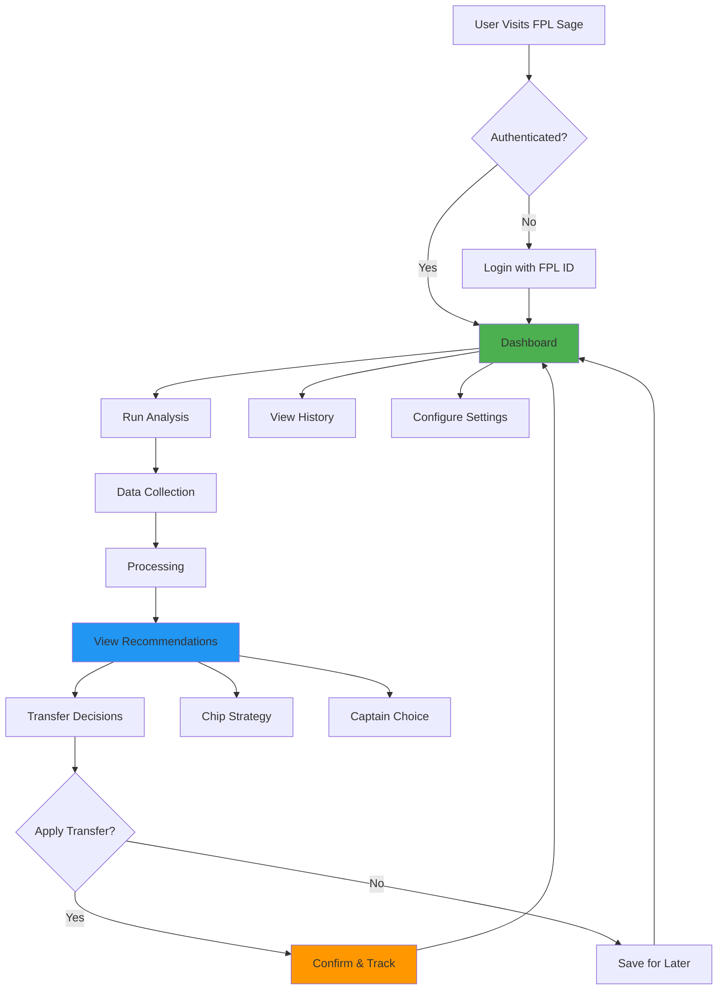

---

## Detailed User Flows

### 1. Authentication & Onboarding Flow

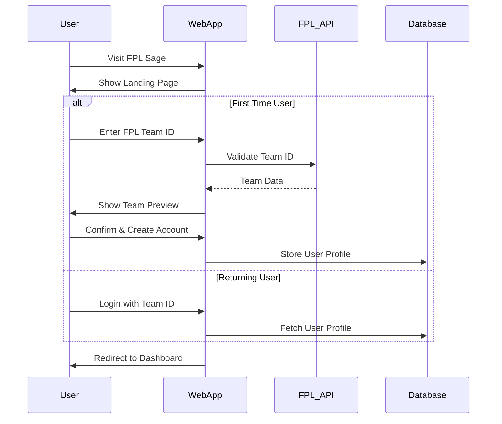

**Web Pages:**
- `/` - Landing page with value proposition
- `/login` - Simple FPL Team ID entry
- `/onboarding` - Team preview & settings setup
- `/dashboard` - Main application hub

---

### 2. Dashboard Flow

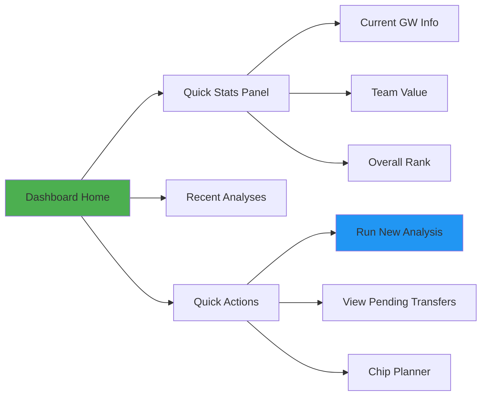

**Dashboard Components:**

| Component | Purpose | Data Source |
|-----------|---------|-------------|
| **Hero Stats** | GW, Rank, Team Value | Latest snapshot |
| **Active Recommendations** | Current transfer suggestions | Last analysis |
| **Chip Status** | Available chips with timing advice | Config + Analysis |
| **Upcoming Fixtures** | Next 3 GWs for your team | Fixture model |
| **Analysis History** | Past recommendations & outcomes | Run history |
| **Quick Actions** | One-click analysis, transfers, chips | Action buttons |

---

### 3. Analysis Workflow

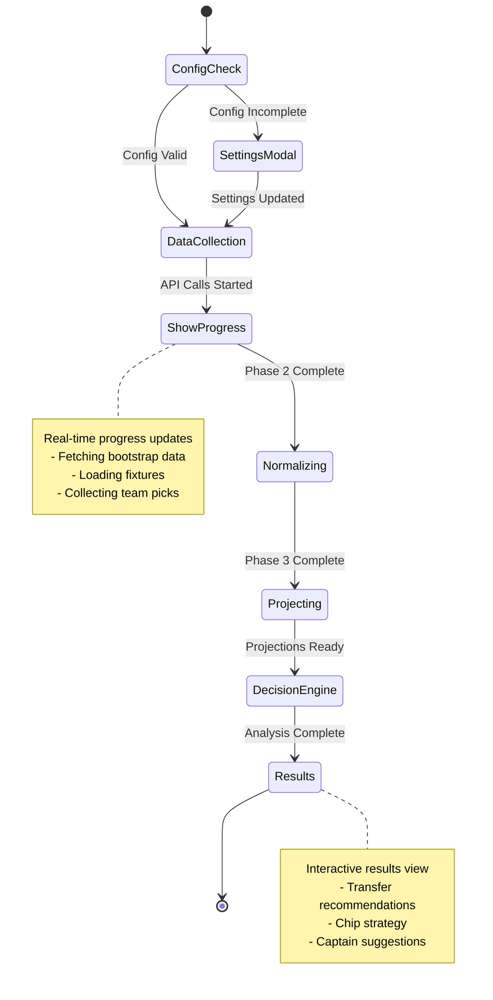

**Analysis UI Stages:**

1. **Pre-Flight Check** (2 seconds)
   - Verify team ID, transfers, chips
   - Show override options if needed
   - Display loading skeleton

2. **Data Collection** (5-8 seconds)
   - Progress bar with phases
   - Live status updates: "Fetching 615 players..."
   - "Analyzing 380 fixtures..."

3. **Processing** (3-5 seconds)
   - Normalize data
   - Run projection engine
   - Calculate recommendations

4. **Results Display** (instant)
   - Animated transition to results
   - Interactive cards for each recommendation
   - Drill-down for detailed reasoning

---

### 4. Transfer Recommendations Flow

```mermaid
graph TB
    Results[Analysis Results] --> TransferSection[Transfer Recommendations]
    
    TransferSection --> Priority1[Priority 1: High Risk]
    TransferSection --> Priority2[Priority 2: Value Plays]
    TransferSection --> Priority3[Priority 3: Future Planning]
    
    Priority1 --> Card1[Transfer Card]
    Priority2 --> Card2[Transfer Card]
    
    Card1 --> PlayerOut[OUT: Player Name]
    Card1 --> PlayerIn[IN: Player Name]
    Card1 --> Reasoning[Why This Transfer?]
    Card1 --> Impact[Expected Impact]
    
    PlayerOut --> OutDetails[Player Stats Widget]
    PlayerIn --> InDetails[Player Stats Widget]
    
    Card1 --> Actions{User Action}
    Actions -->|Accept| AddToCart[Add to Transfer Cart]
    Actions -->|Dismiss| MarkDismissed[Mark as Dismissed]
    Actions -->|Later| SaveForLater[Save for Later]
    
    AddToCart --> Cart[Transfer Cart]
    Cart --> Review[Review All Transfers]
    Review --> Execute[Execute Transfers]
    
    style Priority1 fill:#F44336
    style Card1 fill:#2196F3
    style Cart fill:#FF9800
```

**Transfer Card Design:**

```
┌────────────────────────────────────────────┐
│ 🚨 PRIORITY 1: Remove High-Risk Players   │
├────────────────────────────────────────────┤
│                                            │
│ OUT: Bruno Fernandes (MUN)                │
│ ├─ Status: ⚠️ Injured (no return date)    │
│ ├─ Next GW: 0.0 pts expected              │
│ └─ Price: £8.3m → £8.2m (dropping)       │
│                                            │
│ IN: Kevin De Bruyne (MCI)                 │
│ ├─ Fixture: 🏠 vs Brighton (Easy)         │
│ ├─ Next GW: 8.3 pts expected              │
│ ├─ Next 6: 47.2 pts expected              │
│ └─ Price: £9.5m (stable)                  │
│                                            │
│ 📊 Expected Gain: +8.3 pts                │
│ 💰 Cost: Free Transfer                    │
│                                            │
│ ┌────────────┬──────────────┬─────────┐  │
│ │ ✅ Accept  │ 💾 Save     │ ✖️ Dismiss │  │
│ └────────────┴──────────────┴─────────┘  │
└────────────────────────────────────────────┘
```

---

### 5. Chip Strategy Flow

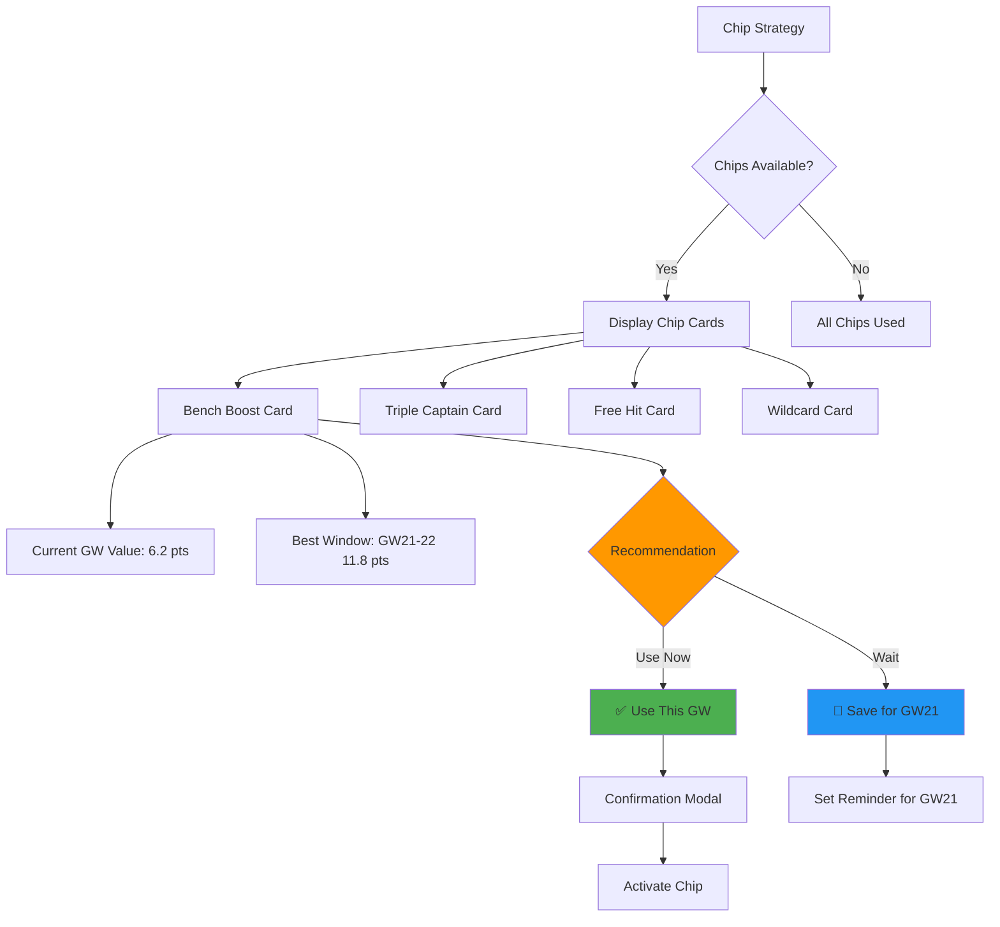

**Chip Card Design:**

```
┌────────────────────────────────────────────┐
│ 🎯 BENCH BOOST                            │
├────────────────────────────────────────────┤
│ Current Status: ✅ Available              │
│                                            │
│ THIS GAMEWEEK (GW18)                      │
│ └─ Potential: 6.2 points                  │
│                                            │
│ BEST UPCOMING WINDOW                      │
│ ├─ Gameweek: GW21-22                     │
│ ├─ Potential: 11.8 points                │
│ └─ Why: DGW + favorable fixtures          │
│                                            │
│ 💡 RECOMMENDATION: WAIT                   │
│ Expected gain if delayed: +5.6 pts        │
│                                            │
│ ┌────────────┬──────────────┐            │
│ │ ⏰ Remind  │ 🔍 View DGW  │            │
│ │   Me GW21  │    Details   │            │
│ └────────────┴──────────────┘            │
└────────────────────────────────────────────┘
```

---

### 6. Captain Selection Flow

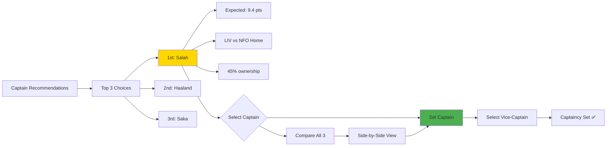

---

### 7. Settings & Configuration Flow

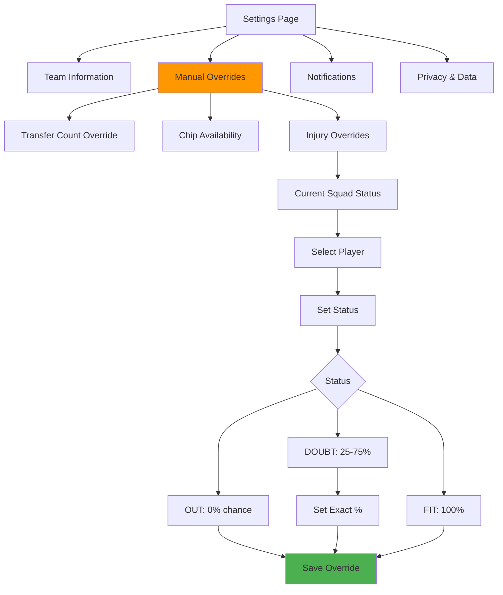

---

## Page Layouts

### Dashboard Layout

```
┌──────────────────────────────────────────────────────┐
│  Header: FPL Sage | GW18 | Your Team Name           │
├──────────────────────────────────────────────────────┤
│                                                      │
│  ┌───────────┐ ┌───────────┐ ┌────────────┐       │
│  │ Rank      │ │ Team Value│ │ Next GW    │       │
│  │ 234,567   │ │ £102.3m   │ │ Jan 21     │       │
│  └───────────┘ └───────────┘ └────────────┘       │
│                                                      │
│  ┌─────────────────────────────────────────────┐   │
│  │ 🎯 Active Recommendations (2)               │   │
│  ├─────────────────────────────────────────────┤   │
│  │ • Replace Bruno Fernandes (injured)         │   │
│  │ • Save Bench Boost for GW21 DGW            │   │
│  │                                              │   │
│  │ [Run New Analysis]  [View Details]         │   │
│  └─────────────────────────────────────────────┘   │
│                                                      │
│  ┌───────────────────┐ ┌──────────────────────┐   │
│  │ Chip Status       │ │ Upcoming Fixtures     │   │
│  ├───────────────────┤ ├──────────────────────┤   │
│  │ ✅ Bench Boost    │ │ GW18: vs MUN (A)     │   │
│  │ ✅ Triple Captain │ │ GW19: vs BHA (H)     │   │
│  │ ❌ Free Hit       │ │ GW20: vs CHE (A)     │   │
│  │ ✅ Wildcard       │ │                       │   │
│  └───────────────────┘ └──────────────────────┘   │
│                                                      │
│  ┌─────────────────────────────────────────────┐   │
│  │ 📊 Analysis History                         │   │
│  ├─────────────────────────────────────────────┤   │
│  │ Jan 18, 2026 - GW18 Analysis                │   │
│  │ Jan 11, 2026 - GW17 Analysis                │   │
│  │ Jan 04, 2026 - GW16 Analysis                │   │
│  └─────────────────────────────────────────────┘   │
│                                                      │
└──────────────────────────────────────────────────────┘
```

### Results Layout

```
┌──────────────────────────────────────────────────────┐
│  Analysis Results - GW18 | Jan 18, 2026             │
├──────────────────────────────────────────────────────┤
│                                                      │
│  ┌─ Tabs ──────────────────────────────────┐       │
│  │ [Transfers] [Chips] [Captain] [Team XI] │       │
│  └──────────────────────────────────────────┘       │
│                                                      │
│  🚨 TRANSFER RECOMMENDATIONS                        │
│  ┌─────────────────────────────────────────────┐   │
│  │ Priority 1: High Risk                       │   │
│  │ [Transfer Card with OUT/IN players]         │   │
│  └─────────────────────────────────────────────┘   │
│                                                      │
│  ┌─────────────────────────────────────────────┐   │
│  │ Priority 2: Value Plays                     │   │
│  │ [Transfer Card with OUT/IN players]         │   │
│  └─────────────────────────────────────────────┘   │
│                                                      │
│  💾 Transfer Cart (0)                               │
│  [No transfers selected]                             │
│                                                      │
│  ┌────────────────────────────────┐                │
│  │ [Save Analysis] [Export PDF]   │                │
│  └────────────────────────────────┘                │
│                                                      │
└──────────────────────────────────────────────────────┘
```

---

## Interactive Features

### 1. Real-Time Progress Updates

During analysis, show live progress:

```javascript
// WebSocket or Server-Sent Events
{
  "phase": "collection",
  "step": "bootstrap",
  "progress": 33,
  "message": "Fetching 615 players...",
  "timestamp": "2026-01-18T10:23:45Z"
}
```

**UI displays:**
- Progress bar: 33%
- Status: "Fetching 615 players..."
- Estimated time: "~6 seconds remaining"

### 2. Player Comparison Modal

Click "Compare" on any transfer card:

```
┌────────────────────────────────────────────┐
│  PLAYER COMPARISON                        │
├────────────────────────────────────────────┤
│                                            │
│  OUT: Bruno Fernandes    IN: De Bruyne    │
│  ─────────────────────  ─────────────────  │
│  Status: ⚠️ Injured      ✅ Fit            │
│  Next GW: 0.0 pts       8.3 pts            │
│  Next 6: 0.0 pts        47.2 pts           │
│  Form: -                4.8                │
│  Fixtures: -            ⭐⭐⭐⭐            │
│  Ownership: 23.4%       18.9%              │
│  Price: £8.3m           £9.5m              │
│                                            │
│  [Close] [Select This Transfer]           │
└────────────────────────────────────────────┘
```

### 3. Chip Timing Calendar

Visual calendar showing chip optimization:

```
GW18   GW19   GW20   GW21   GW22   GW23
 │      │      │   ┌──────────┐    │
 │      │      │   │  🎯 BEST │    │
 │      │      │   │  WINDOW  │    │
 │      │      │   │  11.8pts │    │
 │      │      │   └──────────┘    │
6.2pts 5.4pts 8.1pts            7.9pts
```

Click any GW to see detailed projections for that week.

### 4. Transfer Cart System

Like e-commerce shopping cart:

```
┌────────────────────────────────────┐
│ 🛒 TRANSFER CART (2)              │
├────────────────────────────────────┤
│ 1. Bruno → De Bruyne (Free)      │
│ 2. Isak → Watkins (-4 hit)       │
│                                    │
│ Total Cost: -4 points              │
│ Expected Gain: +12.4 pts          │
│ Net Benefit: +8.4 pts             │
│                                    │
│ [Clear Cart] [Execute Transfers]  │
└────────────────────────────────────┘
```

---

## Technical Architecture for Web

### Frontend Stack

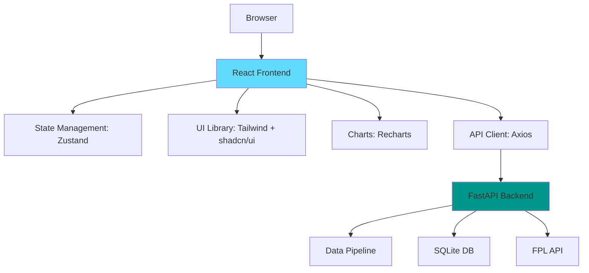

**Frontend Technologies:**
- **Framework**: React with TypeScript
- **State**: Zustand for global state
- **UI**: Tailwind CSS + shadcn/ui components
- **Charts**: Recharts for data visualization
- **Routing**: React Router
- **Forms**: React Hook Form + Zod validation

**Backend API:**
- **Framework**: FastAPI (Python)
- **WebSockets**: For real-time progress updates
- **Background Jobs**: Celery or FastAPI BackgroundTasks
- **Database**: Existing SQLite (with optional PostgreSQL)

### API Endpoints

```
POST   /api/v1/auth/login           - Authenticate with FPL team ID
GET    /api/v1/user/profile         - Get user profile
GET    /api/v1/user/config          - Get team configuration

POST   /api/v1/analysis/run         - Trigger new analysis
GET    /api/v1/analysis/{run_id}    - Get analysis results
GET    /api/v1/analysis/history     - Get past analyses
WS     /api/v1/analysis/progress    - Real-time progress updates

GET    /api/v1/transfers/recommendations - Get transfer suggestions
POST   /api/v1/transfers/cart       - Manage transfer cart
POST   /api/v1/transfers/execute    - Execute transfers (future)

GET    /api/v1/chips/strategy       - Get chip recommendations
POST   /api/v1/chips/schedule       - Schedule chip reminders

GET    /api/v1/captain/suggestions  - Get captain recommendations
POST   /api/v1/captain/set          - Set captain choice (future)

GET    /api/v1/team/current         - Get current team
GET    /api/v1/fixtures/upcoming    - Get upcoming fixtures
```

### Real-Time Updates Flow

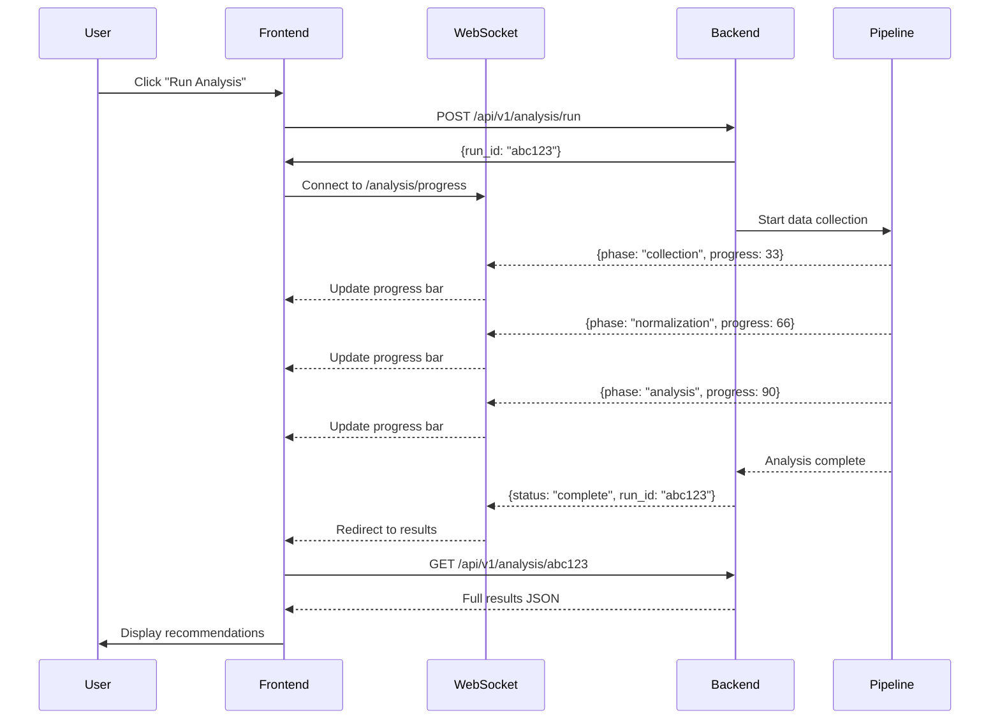

---

## Mobile Responsiveness

### Mobile Layout Priority

```
┌─────────────────┐
│  FPL Sage      │
│  GW18 | Rank   │
├─────────────────┤
│                 │
│ ┌─────────────┐ │
│ │ Run Analysis│ │
│ └─────────────┘ │
│                 │
│ Active Recs (2) │
│ • Replace Bruno │
│ • Save BB GW21  │
│                 │
│ ┌─────────────┐ │
│ │ Chips       │ │
│ ├─────────────┤ │
│ │ ✅ BB       │ │
│ │ ✅ TC       │ │
│ └─────────────┘ │
│                 │
│ [History]       │
│                 │
└─────────────────┘
```

**Mobile-First Features:**
- Swipeable transfer cards
- Bottom sheet modals for details
- Sticky "Run Analysis" FAB button
- Collapsible sections
- Touch-friendly buttons (min 44px)

---

## Progressive Web App (PWA)

### Offline Capabilities

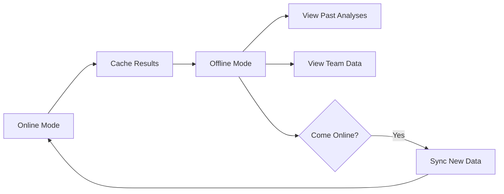

**PWA Features:**
- Install as app on mobile/desktop
- View past analyses offline
- Background sync when online
- Push notifications for:
  - Analysis complete
  - Price changes on your players
  - Chip timing reminders
  - Deadline approaching alerts

---

## Future Enhancements

### Phase 2 Features

1. **Social Features**
   - Compare with friends' teams
   - League mini-leagues analysis
   - Share recommendations

2. **Advanced Analytics**
   - Historical accuracy tracking
   - "What if" scenario simulator
   - ML-powered projections

3. **Automation**
   - Auto-run analysis before deadline
   - Scheduled email reports
   - Telegram/Discord bot integration

4. **Team Building**
   - Wildcard optimizer
   - Team draft simulator
   - Budget allocation helper

---

## Conclusion

This web UI transformation makes FPL Sage:
- **More Accessible**: No CLI knowledge needed
- **More Visual**: Charts, cards, interactive elements
- **More Engaging**: Real-time updates, animations
- **More Powerful**: Side-by-side comparisons, what-if scenarios
- **More Mobile**: Responsive design, PWA support

The core decision engine remains unchanged - we're just wrapping the brilliant analysis in a modern, user-friendly interface.
```
