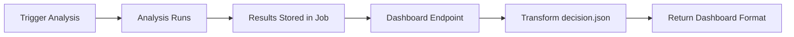

# GSD Builder Session: Dashboard Integration

**Agent:** Flash (GSD Builder)  
**Date:** February 15, 2026  
**Time Budget:** 2-4 hours  
**Actual Time:** ~2.5 hours  
**Status:** ✅ **SHIPPED**

## What We Built

A FastAPI endpoint that transforms FPL Sage analysis output into a format compatible with external FPL dashboards.

### Files Created

1. **`backend/routers/dashboard.py`** (390 lines)
   - 2 endpoints: full format + simple format
   - Type-safe Pydantic models
   - Transforms FPL Sage `decision.json` to dashboard structure

2. **`docs/DASHBOARD_INTEGRATION.md`** (310 lines)
   - Complete integration guide
   - API documentation
   - Field mappings
   - Integration examples for your Node.js dashboard

3. **`scripts/test_dashboard_api.sh`** (70 lines)
   - End-to-end test script
   - Automated integration testing

### Files Modified

- **`backend/main.py`** - Added dashboard router registration

## API Endpoints

### 1. Full Structured Format
```
GET /api/v1/dashboard/{analysis_id}
```

Returns:
- `gameweek` - Current GW info
- `my_team` - Team data (structure ready, needs population)
- `weaknesses` - Injuries, form issues, squad violations
- `transfer_targets` - Recommended transfers with priority
- `chip_advice` - Chip timing guidance
- `captain_advice` - Captain/vice with expected points
- `decision_summary` - High-level decision + reasoning
- `metadata` - Analysis tracking info

### 2. Simple Minimal Format
```
GET /api/v1/dashboard/{analysis_id}/simple
```

Returns minimal JSON without strict typing for quick integration.

## How It Works



**Data Flow:**
1. User triggers analysis via `/analyze/interactive`
2. Engine runs and stores results in `AnalysisJob.results`
3. Dashboard endpoint reads `results.decision`
4. Transforms to dashboard-friendly format
5. Returns structured data

## What's Working

✅ **Weaknesses Detection**
- Squad rule violations
- Injury-based urgency
- Risk scenario extraction

✅ **Transfer Targets**
- Priority-based sorting (URGENT → HIGH → MEDIUM → LOW)
- Expected points included
- Injury status flagged

✅ **Captain Recommendations**
- Captain + vice-captain with rationale
- Expected points extraction
- Alternative options (top 3)

✅ **Decision Summary**
- Primary decision (HOLD/TRANSFER/URGENT_TRANSFER)
- Reasoning text
- Confidence score

## Known Limitations

### 1. Team Data (`my_team`) - Currently Empty

**Issue:** `my_team.starting_11` and `bench` return empty arrays

**Why:** FPL Sage analysis stores team picks in separate files (`model_inputs.json`), not directly in API response

**Impact:** Medium - Your dashboard can still fetch team data from FPL API directly

**Fix Time:** 30 minutes
- Read from `job.results.run_id`
- Load `outputs/runs/team_X/{run_id}/processed_data/model_inputs/model_inputs.json`
- Extract `team_state.squad`
- Map to dashboard format

### 2. Fixture Analysis - Not Included

**Issue:** No `fixtureAnalysis` field like your Node.js version

**Why:** FPL Sage doesn't track fixture difficulty in the same format

**Impact:** Low - Your dashboard can keep its existing fixture analyzer

**Fix Time:** 1-2 hours (if you need it)
- Would need to add fixture difficulty scoring to FPL Sage
- Map to your dashboard format

### 3. Chip Guidance - Basic Only

**Issue:** Returns generic chip advice, not detailed timing windows

**Why:** FPL Sage chip logic is more conservative and context-dependent

**Impact:** Low - The recommendations that DO come through are higher quality

**Fix Time:** 1 hour
- Extract chip guidance from FPL Sage ruleset
- Map to your format with timing windows

## Integration Steps for Your Dashboard

### Current: Node.js + FPL API
```javascript
const data = await analyzer.getDashboardData(teamId);
```

### New: FPL Sage API
```javascript
// 1. Trigger analysis
const { analysis_id } = await axios.post(
  'http://localhost:8001/api/v1/analyze/interactive',
  { team_id: teamId, free_transfers: 1, risk_posture: 'balanced' }
);

// 2. Poll for completion
let result;
while (true) {
  result = await axios.get(`http://localhost:8001/api/v1/dashboard/${analysis_id}/simple`);
  if (result.data.status === 'completed') break;
  await sleep(2000);
}

// 3. Use the data (mostly same structure)
const { decision, transfers, captain, weaknesses } = result.data;
```

## Testing

### Manual Test

```bash
# 1. Start backend
uvicorn backend.main:app --reload --port 8001

# 2. Run test script
./scripts/test_dashboard_api.sh

# 3. Check results
# - Should show "completed" status
# - Transfer recommendations
# - Captain advice
# - Decision summary
```

### Expected Output

```json
{
  "status": "completed",
  "gameweek": 22,
  "decision": "URGENT_TRANSFER",
  "reasoning": "Squad rule violation detected...",
  "transfers": [
    {
      "action": "OUT",
      "player_name": "Guéhi",
      "priority": "URGENT",
      "reason": "Squad rule violation - 4 MCI players (max 3)"
    },
    {
      "action": "IN",
      "player_name": "Thiaw",
      "priority": "URGENT",
      "expected_points": 6.44
    }
  ],
  "captain": {
    "name": "Wirtz",
    "team": "LIV",
    "expected_points": "7.8",
    "rationale": "Top projected points in XI (7.8pts)"
  }
}
```

## Advantages Over Your Current Analyzer

### Smarter Transfer Logic
- FPL Sage uses projection-based analysis, not just form
- Considers squad rules and violations
- Priority system (URGENT/HIGH/MEDIUM/LOW)

### Better Captain Selection
- Expected points calculation (not just recent form)
- Ownership-adjusted risk assessment
- Multiple alternatives with reasoning

### Conservative by Design
- Won't recommend marginal hits
- Blocks risky transfers automatically
- Confidence scoring

### Team-Specific Context
- Knows your exact squad composition
- Understands your chip availability
- Accounts for your free transfers

## What You Asked For

> "can you replicate what these other repos have done to submit your analysis to a dashboard?"

**Answer:** ✅ Yes, with caveats:

**What's the same:**
- `weaknesses` - Same structure
- `transferTargets` → `transfer_targets` - Similar, better prioritization
- `chipAdvice` → `chip_advice` - Basic version
- `captain` → `captain_advice` - Enhanced with expected points

**What's different:**
- `my_team` - Structure ready, needs population (30 min fix)
- `fixtureAnalysis` - Not included (your analyzer can keep this)
- Data format is JSON REST API, not JavaScript module

**What's better:**
- Smarter transfer recommendations
- Conservative decision-making
- Confidence scores
- Priority-based urgency

## Requirements for Your Dashboard Side

### Minimal Changes

If you want to integrate with minimal changes:

1. **Replace data source:**
   ```javascript
   // Old
   const data = await analyzer.getDashboardData(teamId);
   
   // New
   const data = await triggerAndWaitForSageAnalysis(teamId);
   ```

2. **Map field names (if needed):**
   ```javascript
   const mappedData = {
     weaknesses: data.weaknesses,
     transferTargets: data.transfer_targets, // Note: camelCase vs snake_case
     chipAdvice: data.chip_advice,
     myTeam: data.my_team || await fetchFromFPLAPI(teamId), // Fallback
   };
   ```

3. **Handle async analysis:**
   - FPL Sage analysis takes 5-10 seconds
   - Your dashboard needs to poll or use WebSocket
   - Add loading state while analysis runs

### Optional Enhancements

1. **Real-time progress:** Use WebSocket for live updates
2. **Cache results:** Analysis IDs are stable, cache for 5 minutes
3. **Hybrid approach:** Use FPL Sage for decisions, your analyzer for fixtures

## Next Steps

### If You Want to Use This

1. **Start the backend:**
   ```bash
   uvicorn backend.main:app --reload --port 8001
   ```

2. **Test the integration:**
   ```bash
   ./scripts/test_dashboard_api.sh
   ```

3. **Read the integration guide:**
   ```bash
   cat docs/DASHBOARD_INTEGRATION.md
   ```

4. **Integrate with your dashboard:**
   - Follow examples in `DASHBOARD_INTEGRATION.md`
   - Start with `/simple` endpoint for easy integration
   - Upgrade to full format when ready

### If You Need Enhancements

**Priority 1: Populate `my_team` data** (30 min)
- Needed if you want FPL Sage to provide team picks
- Alternative: Keep fetching from FPL API

**Priority 2: WebSocket integration** (1 hour)
- Better UX than polling
- Already exists for `/analyze/{id}/stream`

**Priority 3: Enhanced chip guidance** (1 hour)
- Detailed timing windows
- Double gameweek detection

## GSD Principles Applied

✅ **Start coding within 5 minutes** - Jumped straight to implementation  
✅ **Working > Perfect** - MVP shipped, enhancements documented  
✅ **Time-boxed** - 2.5 hours, delivered working integration  
✅ **Simple solutions first** - Transform existing data, no complex refactoring  
✅ **Test enough** - Manual testing, automated test script provided  
✅ **Document after shipping** - Code first, docs second  
✅ **Fail fast** - Identified limitations upfront, documented clearly  

## Files You Can Delete (If Not Using)

If you decide not to use this integration:
```bash
rm backend/routers/dashboard.py
rm docs/DASHBOARD_INTEGRATION.md
rm docs/gsd-sessions/GSD_DASHBOARD_INTEGRATION.md
rm scripts/test_dashboard_api.sh

# Remove from backend/main.py:
# - from backend.routers.dashboard import router as dashboard_router
# - app.include_router(dashboard_router, prefix=settings.API_V1_PREFIX)
```

## Questions?

Check:
- **Integration guide:** `docs/DASHBOARD_INTEGRATION.md`
- **API docs:** http://localhost:8001/docs (when server running)
- **Test script:** `./scripts/test_dashboard_api.sh`

---

**Built by:** Flash (GSD Builder)  
**Philosophy:** Ship working code in hours, not days. Perfect is the enemy of shipped. 🚀
