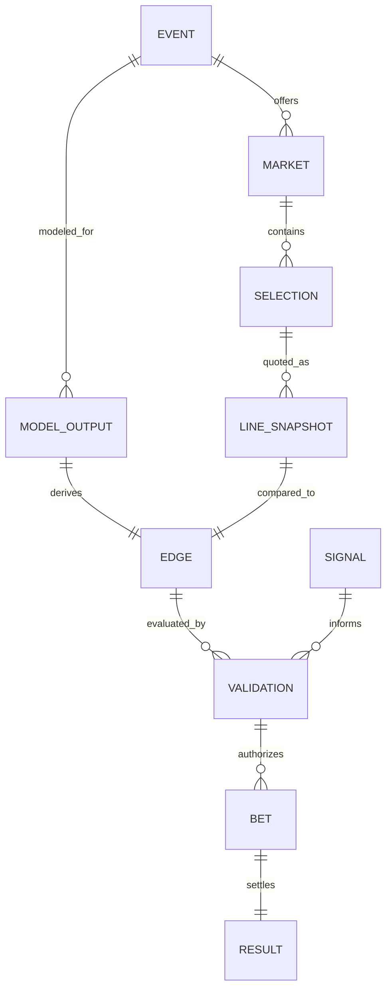
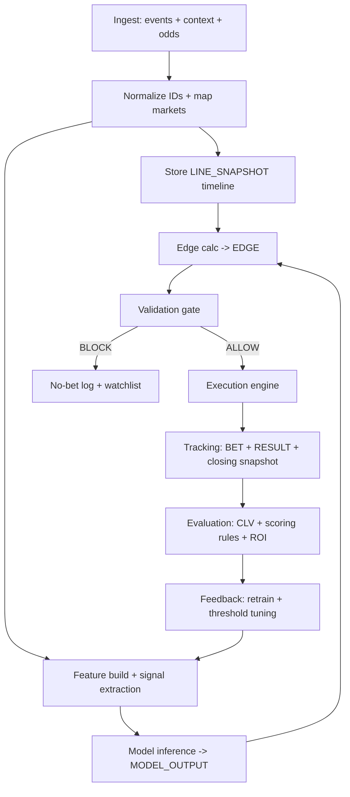

# Cognitive Knife for Sports Betting

## Executive summary

A sports-betting “Cognitive Knife” that reliably *produces winning outcomes* cannot be engineered as a “pick generator.” It has to be engineered as a **decision-quality system** that (a) estimates outcome distributions better than the market *in targeted slices*, (b) translates those estimates into **expected value (EV)** versus actual offered lines, (c) enforces a **validation gate** and bankroll constraints so that edge survives execution reality (limits, latency, line moves, correlation), and (d) continuously measures whether it is actually beating the market using **closing line value (CLV)** and proper probabilistic scoring. Research on betting markets shows (i) major markets are often *mostly reliable*, yet can display exploitable inefficiencies such as **overreaction** and lead-time anomalies, and (ii) sportsbook pricing can incorporate bettor preferences and does not necessarily aim to balance action—meaning “public narratives” can matter, but only as *signals* tested against data, not vibes. citeturn9view2turn9view1

A practical design pattern that aligns with the literature is:

- Treat the sportsbook/exchange line as a *noisy, time-indexed forecast* and the model as a competing forecast; evaluate the *forecasting + decision* pair with **proper scoring rules** and realized P&L (not just hit-rate). citeturn2search1turn2search2  
- Prioritize **calibration** over raw accuracy when probabilities drive wagers; empirical work in sports betting finds calibration-optimized model selection can dominate accuracy-optimized selection in profit outcomes under common staking rules, and Kelly-style staking is particularly sensitive to probability miscalibration. citeturn6search2turn10academia32  
- Make “time” first-class: store **LINE_SNAPSHOT(open, current, close)**, detect rapid moves (“steam”), compute CLV, and use these as both evaluation and as market-microstructure signals. The academic evidence is clear that pricing dynamics from open→close and close→outcome contain structure (e.g., autocorrelation/overreaction effects, non-monotonic forecast improvement at certain lead times). citeturn9view0turn9view2  
- Operationally, beating the market is limited more by **data quality + latency + execution constraints + overfitting risk** than by fancy modeling. Validation must include walk-forward testing, backtest-overfitting safeguards, and realistic execution simulation. citeturn2search4turn2search14  

Measurable success criteria (actionable, testable) are:

- **Positive CLV** over a large sample in targeted markets (a necessary condition for long-run edge in efficient markets; not sufficient alone). citeturn9view0turn9view2  
- **Probability quality**: improved log score / Brier score versus bookmaker-implied probabilities (after vig normalization) on a walk-forward basis. citeturn2search1turn2search2  
- **Risk-adjusted profitability**: positive EV and ROI after fees/vig with bounded drawdown and acceptable Sharpe-like risk-adjusted return metrics (adapted carefully for betting return distributions). citeturn1search18turn6search15  

Assumptions noted (because they are unspecified): target sports/markets, jurisdictions and legal constraints, execution venue(s) and access, bankroll size, risk tolerance, and technology stack.

## Research-grounded principles for sustainable edge

Sports betting markets are **often close to efficient** in mainstream leagues/markets, and the bookmaker margin (“vig”) means that being merely “a bit right” still loses money. The implication for system design is blunt: you don’t need a system that predicts winners; you need one that finds **systematic mispricing** and survives real-world execution. citeturn9view2turn0search18  

Two findings from the literature matter directly for your ontology and workflow design:

First, sportsbooks are not guaranteed to be passive market makers trying to balance action. Classical work using bet quantity data shows lines may be set to **maximize profits** and can reflect bettor preferences; in that framing, distortions can exist but are bounded by the risk of informed bettors taking the other side. citeturn9view1turn0search14  

Second, while forecasts embedded in betting lines are “mostly reliable” in many cases, there is evidence of **weak-form inefficiency** and exploitable patterns (e.g., overreaction and timing effects). In MLB markets with real-time line movement, one peer-reviewed study finds evidence sufficient to reject weak-form efficiency and reports negatively autocorrelated changes consistent with overreaction; it also reports that forecast quality does not always improve monotonically as game time approaches, including measurable degradation at specific pregame times. citeturn9view2  

A complementary decision-theoretic result: in spread/total wagering, you can sometimes achieve positive expected profit without dramatically “beating” the sportsbook’s point estimate; small biases relative to the true median can matter, and optimal wagering depends on distributional features (quantiles), not just means. citeturn10search1  

These findings translate into design requirements:

- You must store and reason about **distributions** (or at least quantiles) for spread/total/props, not only point predictions. citeturn10search1turn1search7  
- You must store line evolution over time and treat it as information: open, current, close; plus timestamps for each. citeturn9view2turn9view0  
- You must build a validation gate that explicitly models (and logs) execution constraints and avoids overfitting, because selection bias and backtest-overfitting are endemic in strategy search. citeturn2search4turn2search0  

## Ontology and lexicon design for entity["organization","Cognitive Knife","ontology-driven decision system"]

This section gives a **repo-ready ontology + lexicon** pattern built for sports betting, with versioning, constraints, and provenance/audit hooks.

### Ontology design goals

The ontology should do four things that ad-hoc betting scripts almost never do:

- Enforce separation between **Projection → Edge → Decision (Bet)** so “feelings” can’t skip steps.
- Make time first-class via **LINE_SNAPSHOT** and **MODEL_OUTPUT versioning**.
- Represent *why* a bet happened with machine-readable **justification artifacts** (signals, thresholds, constraints).
- Preserve provenance/auditability of every decision to enable root-cause analysis when (not if) things go sideways; the W3C PROV model is a mature standard for representing entities, activities, and agents involved in producing data/decisions. citeturn8search1turn8search3  

### Entities, relations, constraints, versioning

**Core entities (minimum viable):** EVENT, MARKET, SELECTION, LINE_SNAPSHOT, MODEL_OUTPUT, EDGE, SIGNAL, VALIDATION, BET, RESULT.

**Key relations (high signal):**  
EVENT *offers* MARKET; MARKET *contains* SELECTION; LINE_SNAPSHOT *quotes* SELECTION; MODEL_OUTPUT *predicts* SELECTION given EVENT context; EDGE *compares* MODEL_OUTPUT to LINE_SNAPSHOT; SIGNAL *influences* EDGE/VALIDATION; VALIDATION *authorizes* BET; RESULT *settles* BET.

**Versioning:** Use SemVer for public ontology/lexicon contracts so breaking changes are explicit: MAJOR for incompatible schema/meaning changes, MINOR for additive changes, PATCH for clarifications/typos. citeturn8search0  

### Mermaid diagram for entity relationships



### Repo-ready ontology file example

```markdown
---
id: sports-betting-ontology
version: 1.0.0
semver: true
status: draft
---

# Sports Betting Ontology

## Scope
Defines canonical entities, relations, and constraints for modeling sports betting as an ontology-driven decision system.

## Entities

### EVENT
A scheduled or live contest instance (game/match).
Required fields: event_id, sport, league, start_time_utc, participants, venue_id.

### MARKET
A bettable market offered for an EVENT (e.g., spread, total, moneyline, player prop).
Required fields: market_id, event_id, market_type, period (full_game, first_half, etc).

### SELECTION
A specific outcome within a MARKET (e.g., TeamA -3.5, Over 8.5).
Required fields: selection_id, market_id, side, threshold (nullable), participant_id (nullable).

### LINE_SNAPSHOT
A time-stamped quote for a SELECTION.
Required fields: line_snapshot_id, selection_id, source_id, ts_utc, price, odds_format, limits (nullable), is_in_play.

### MODEL_OUTPUT
A time-stamped model forecast for a SELECTION.
Required fields: model_output_id, selection_id, model_version, ts_utc, p_win (nullable), dist_params (nullable), quantiles (nullable), features_hash.

### EDGE
Computed advantage for a SELECTION given a MODEL_OUTPUT and LINE_SNAPSHOT.
Required fields: edge_id, selection_id, model_output_id, line_snapshot_id, ev, kelly_fraction (nullable), edge_type.

### SIGNAL
A structured feature or diagnostic used for validation (injury delta, weather delta, steam flag, umpire bias score, etc.).
Required fields: signal_id, event_id, signal_type, ts_utc, value, confidence, provenance_ref.

### VALIDATION
Decision record that either authorizes or blocks a BET.
Required fields: validation_id, edge_id, ts_utc, decision (ALLOW|BLOCK|WATCH), reasons[], threshold_set_version.

### BET
An executed wager instruction and its acknowledgement.
Required fields: bet_id, selection_id, line_snapshot_id, stake, ts_utc, execution_venue, status, ticket_ref.

### RESULT
Settlement and realized outcome for a BET.
Required fields: result_id, bet_id, settled_ts_utc, outcome (WIN|LOSS|PUSH|VOID), pnl, closing_line_snapshot_id.

## Global Constraints
- BET requires VALIDATION.decision = ALLOW.
- EDGE requires both MODEL_OUTPUT and LINE_SNAPSHOT.
- RESULT must reference the settlement line or closing line snapshot for CLV.
- Every entity record must have provenance_ref or derivation fields enabling auditability.
```

### Repo-ready lexicon file example

```markdown
---
id: sports-betting-lexicon
version: 1.0.0
status: draft
---

# Sports Betting Lexicon

## Canonical terms (MUST use)

Edge:
Difference between model-implied value and offered market line, expressed as EV in units of bankroll or currency.

EV (Expected Value):
Expected profit of a bet given probabilities and payout, net of fees/vig where applicable.

CLV (Closing Line Value):
Difference between the bettor’s executed price/line and the closing price/line for the same selection/market.

Signal:
A measurable factor used to adjust confidence or gate execution (injury status, lineup, weather, steam move, etc.).

Validation gate:
Rule set that determines whether an EDGE becomes a BET.

Steam:
Rapid, high-magnitude move in one direction over a short time window, often interpreted as strong information flow.

## Prohibited synonyms / banned phrasing (DO NOT use in decisions)
- “Lock”, “Can’t lose”, “Free money”
- “Feels”, “Vibes”, “Gut”
- “Guaranteed edge”
- “Sharp” without definition/criteria

## Internal tags (examples)
- TAG:EDGE_TIER_A  = EV >= 2.0% and CLV-positive historically in this market slice
- TAG:EDGE_TIER_B  = EV 1.0%–2.0%
- TAG:EDGE_TIER_C  = EV 0.3%–1.0% (watchlist)
- TAG:NO_PLAY      = blocked by validation gate
- TAG:STEAM        = steam detection true
- TAG:NEWS_RISK     = key injury/lineup uncertainty unresolved
```

## Data sources and ingestion strategy

A *winning* system is usually beaten by one of three boring things: bad IDs, stale odds, or missing late-breaking context. So ingestion design is not “plumbing,” it’s alpha preservation.

### Candidate data sources and priority

**Table: data source options (illustrative shortlist)**

| Need | Candidate source | Notes on access, quality, constraints |
|---|---|---|
| Exchange odds + order book + execution | entity["company","Betfair","betting exchange api"] | Strong API ecosystem for market discovery, live prices, and automation; request-weight limits and explicit rate constraints must be engineered into collectors/execution. citeturn0search22turn7search2turn0search15 |
| Sharp-ish bookmaker reference | entity["company","Pinnacle","sportsbook api"] | Public access to the API suite has been closed since July 23, 2025 (bespoke access only), which changes feasibility assumptions for automated ingestion. citeturn3search0turn3search16 |
| Odds aggregation across books | entity["company","The Odds API","sports odds api aggregator"] | Aggregator-style feed; useful when books lack official APIs, but creates dependency risk (coverage changes, attribution, ToS). citeturn3search4 |
| Enterprise odds feeds | entity["company","Sportradar","odds api provider"] | Offers Odds APIs and book lists; explicitly B2B and not intended for direct client calls—architecture must include a server-side proxy and key management. citeturn3search1turn7search3turn3search25 |
| Enterprise play-by-play + injuries | entity["company","Stats Perform","sports data api provider"] | Broad coverage via REST APIs; typically commercial onboarding and contracts. citeturn3search2turn3search10 |
| Soccer event data (open research baseline) | entity["company","StatsBomb","open soccer data"] | Open-data repo is valuable for prototyping schemas and xG modeling; still has license/attribution requirements. citeturn3search3 |
| MLB Statcast-like pitch/batted-ball data | entity["organization","Baseball Savant","mlb statcast portal"] | Provides documented CSV exports for Statcast searches; useful for feature development and historical modeling. citeturn4search0 |
| Weather (US official) | entity["organization","National Weather Service","api.weather.gov, usa"] | Official public API with JSON-based forecasts/alerts/observations; cache-friendly design is relevant for system latency strategy. citeturn1search4turn1search12 |
| NBA official injury reporting rules | entity["sports_league","National Basketball Association","nba"] | League publishes injury reporting requirements and timing (e.g., day-before and back-to-back deadlines), which can be encoded as “news risk windows.” citeturn4search2 |
| NFL injury reporting policy | entity["sports_league","National Football League","nfl"] | Formal injury reporting policy specifies required practice/game status reporting and timing (NY time), enabling structured ingestion and “report freshness.” citeturn4search3 |

Design implication: your ontology needs `source_id`, `source_type`, `license_class`, and `sla_expectation` in every ingestion record so the validation gate can downgrade confidence when data is unofficial/stale or ToS-risky.

### Required datasets and “request tables” (what to collect, at what granularity)

A robust baseline requires **three** synchronized timelines per event: (1) event context, (2) market pricing, (3) results/settlement.

**Request table: minimum viable raw feeds**

| Dataset | Grain | Minimum fields | Why it’s non-negotiable |
|---|---|---|---|
| Events schedule + IDs | per event | event_id, start_time_utc, participants, venue, league | Primary join spine; prevents “two Team A’s” disasters. |
| Markets & selections | per market/selection | market_type, period, selection definition, threshold | Allows consistent mapping across books and model objects. |
| Odds / price feed | streaming or frequent polling | ts_utc, price/odds, limits (if available), in_play flag | Required for CLV, steam, execution simulation. citeturn9view2turn7search2 |
| Context feed (injury/lineups) | event-time updates | player status, timestamp, source + confidence | Late info dominates models; league reporting schedules can define “risk windows.” citeturn4search2turn4search3 |
| Weather feed | hourly/nowcast | wind, temp, precipitation, timestamp, venue grid | Strongly relevant in outdoor sports; must be time-aligned. citeturn1search4 |
| Results & settlement | per bet | final stats/outcome, settlement rules, voids | Prevents misleading ROI due to settlement quirks. |

## Operations and workflows

Below is an ontology-aligned workflow that matches what the empirical literature suggests matters: calibration, timing effects, and overreaction/market dynamics. citeturn6search2turn9view2turn9view0  

### Mermaid diagram for system flow



### Workflow stages with rigor requirements

**Data ingestion (batch + real-time):**  
Use a dual track: batch loads for history/model training, and a real-time collector for line snapshots and late-breaking context. Exchange and enterprise APIs impose request/rate constraints; collectors must implement adaptive polling/streaming, backoff, and request budgeting. citeturn7search2turn7search6turn7search3  

**Projection/modeling:**  
Model outputs should be probability distributions or quantiles where appropriate. For soccer, Poisson regression score models remain a strong baseline, including the classic extension for low-score dependence. citeturn1search7turn1search3  
For spread/total betting, decision-theoretic work emphasizes quantiles/medians and distributional thinking (not only expected values). citeturn10search1  

**Edge calculation:**  
Compute EV using model-implied probabilities and offered payouts. For spreads/totals, derive the probability of covering/over/under from the modeled distribution, then compute EV net of fees/vig. (This is where many systems quietly cheat by ignoring margin and settlement details.)

**Signal detection:**  
Signals include both “sports” signals (lineups/injuries/weather) and “market microstructure” signals (steam, stale lines, cross-book divergence). Because the literature shows market forecasts can overreact and exhibit lead-time anomalies, your signals should explicitly include **autocorrelation/mean-reversion diagnostics** in line movement. citeturn9view2turn9view0  

**Validation gate:**  
The gate must separate “model says value” from “we should bet.” It should incorporate: data freshness, signal conflict checks, correlation limits, execution venue constraints, and a minimum expected edge threshold tuned via walk-forward evaluation.

**Ranking:**  
Rank candidates by risk-adjusted EV (e.g., EV per unit variance, or EV under conservative probability bounds), not raw EV. This avoids “one giant uncertain edge” dominating the slate.

**Execution:**  
Execution must be logged as an activity with inputs, outputs, and agent identity (human vs bot) so you can audit why something was placed and under what line snapshot. Provenance modeling is directly supported by the W3C PROV conceptual model. citeturn8search1turn8search3  

**Tracking + feedback loops:**  
Log results, store closing line snapshots, compute CLV, and then feed back into: (a) model recalibration, (b) threshold tuning, (c) signal weight updates, (d) data-quality score adjustments.

### Table: model types and where they fit

| Model type | Best for | Strengths | Failure modes / cautions |
|---|---|---|---|
| Market-implied baseline (vig-adjusted) | Any market | Hard-to-beat benchmark; great for sanity checks | Can’t discover edge by definition; only measures it. citeturn9view2 |
| Poisson / Dixon–Coles-style score model | Soccer totals/1X2 derivatives | Interpretable; distributional outputs; strong baseline | Misses tactical/context shifts; requires careful recency dynamics. citeturn1search7 |
| Logistic regression / GLM | Moneyline / binary outcomes | Calibratable; stable with limited data | Feature leakage and non-stationarity. citeturn2search1 |
| Gradient-boosted trees | Props, nonlinear interactions | Powerful; handles messy features | Overfitting risk; calibration required. citeturn6search2turn2search4 |
| Bayesian hierarchical models | Player props, partial pooling | Handles sparse players/teams; uncertainty explicit | Engineering complexity; computational cost. citeturn2search1 |
| Neural nets | High-dimensional tracking/event data | Can exploit complex patterns | Usually needs heavy data; calibration and drift control are critical. citeturn10academia34turn6search2 |

Key design point: regardless of model family, **calibration is a first-class deliverable**, not a nice-to-have, because the decision layer converts probabilities into money. citeturn6search2turn10academia32  

## Signal hierarchy, time dimension, and validation gates

### Signal hierarchy and weighting

A practical hierarchy that aligns with both market-efficiency evidence and real-world execution looks like this:

- **Tier 0 (Data integrity):** ID mapping correctness, timestamp sanity, source reliability, staleness, and missingness. These are not “signals,” but they gate whether signals can be trusted.
- **Tier 1 (Structural/role truth):** starting lineup confirmations, pitcher/goalkeeper status, minutes/usage role, major injury status changes, travel/rest constraints when reliably known. League reporting rules can be used to time “confirmation windows.” citeturn4search2turn4search3  
- **Tier 2 (Environment):** weather variables (wind, temp, precipitation), venue effects; in baseball this matters for batted-ball/run environments and can affect totals. citeturn1search4turn4search0  
- **Tier 3 (Officials/ref dynamics):** umpire/referee tendencies and bias measures where robustly estimated. Peer-reviewed research finds measurable referee/umpire biases in multiple sports contexts, implying this category can be real—but it must be treated as uncertain and drift-prone. citeturn5search2turn5search0turn5search34  
- **Tier 4 (Market microstructure):** steam moves, cross-book divergence, stale lines, and mean reversion/overreaction patterns. Evidence of overreaction and non-monotonic improvement at certain lead times makes these signals particularly relevant. citeturn9view2turn9view0  
- **Tier 5 (Narrative/noise):** recency streaks without causal features, “must win,” social-media sentiment—allowed only if it survives out-of-sample testing against a market baseline.

**Weighting approach recommendation:**  
Use a two-layer method:

1) A probabilistic model outputs calibrated probabilities/distributions.  
2) A **validation model** (or ruleset) combines signal tiers into a conservative adjustment to stake size and go/no-go—favoring approaches that incorporate uncertainty explicitly (e.g., shrinkage, Bayesian credible bounds, or worst-case EV under probability intervals). The literature on proper scoring rules supports evaluating the probabilistic layer with strictly proper scores to prevent “gaming your own metric.” citeturn2search1turn2search2  

### Time dimension: line snapshots, CLV, steam

A time-aware system stores:

- **Open snapshot** (first observed)  
- **Current snapshot** (latest)  
- **Close snapshot** (last pre-start)  
- Optional: **post-start snapshots** for in-play markets

Then compute:

- **CLV:** executed price vs close price for same selection and market definition.  
- **Steam detection:** large line movement over short time; defined operationally (example) as movement exceeding X ticks or Y implied-probability points inside a Z-minute window, confirmed across ≥2 independent sources to reduce “single-book noise.”  
- **Overreaction/mean reversion diagnostic:** detect negatively autocorrelated changes (a pattern reported in real-time sportsbook line movement analysis). citeturn9view2  

image_group{"layout":"carousel","aspect_ratio":"16:9","query":["sports betting line movement chart closing line value","betting odds steam move graph","sportsbook odds history chart opening closing line"],"num_per_query":1}

Why CLV is in the ontology (not just a dashboard metric): the academic framing treats price moves as potentially information-driven or sentiment/noise-driven; tracking open→close and close→outcome relationships is how you learn which regime you’re in. citeturn9view0turn9view2  

### Table: validation thresholds that are defensible and testable

These are *starting points*; the system should learn them via walk-forward optimization with overfit controls.

| Gate dimension | Conservative threshold (starter) | Aggressive threshold (starter) | Rationale |
|---|---:|---:|---|
| Minimum EV (straight bet) | ≥ +1.0% of stake | ≥ +0.3% of stake | Small edges are fragile; major markets are efficient and vig eats mistakes. citeturn9view2turn0search18 |
| Probability calibration requirement | Must pass calibration checks; reject if deteriorating | Allow with stake haircut | Empirical sports betting research indicates calibration dominates accuracy for profit outcomes and Kelly sizing is calibration-sensitive. citeturn6search2turn10academia32 |
| CLV guardrail (rolling) | Must be net positive over last N bets | Use as soft signal (stake scaler) | Positive CLV is a strong indicator you’re beating price discovery; not guaranteed profit, but a crucial diagnostic in efficient markets. citeturn9view0turn9view2 |
| News uncertainty window | Block if key status unresolved inside defined window | Watchlist only | League injury-report timing is predictable and can be codified. citeturn4search2turn4search3 |
| Correlation exposure | Max exposure cap per event/cluster | Higher cap with diversification | Prevents “one event nukes bankroll” outcomes; portfolio thinking matters. citeturn1search1turn6search1 |
| Steam conflict rule | Block if betting *into* sharp steam against you | Allow only with strong counter-signal | Market microstructure evidence suggests overreaction exists, but fading steam without evidence often donates money. citeturn9view2turn9view0 |

## Risk management, evaluation, testing, architecture, and roadmap

### Bankroll and risk management rules

A system that finds EV but sizes poorly will still go broke—efficiently, and with great confidence.

**Staking foundation:** Kelly-style sizing maximizes long-run logarithmic growth under correct probabilities, but it has sharp tradeoffs and is sensitive to parameter error; research on Kelly properties emphasizes both its optimality in ideal conditions and its “bad properties” (risk, drawdown) when assumptions are violated or bets are oversized. citeturn1search1turn6search1turn6search4  

Actionable rules that are standard in professional implementations:

- **Fractional Kelly** (e.g., 0.25× to 0.50× Kelly) as the default to reduce drawdowns under model error and non-stationarity. citeturn6search34turn6search1  
- **Risk caps:** max stake per bet, max exposure per event, max daily loss, max weekly drawdown trigger (pause + review). Maximum drawdown is a widely used tail-risk measure and can be tracked directly from equity curve peaks to troughs. citeturn6search15turn6search19  
- **Correlation controls:** treat related markets (same game, same player, same weather) as a cluster for exposure limits.  
- **Uncertainty haircut:** stake = fractional_kelly × confidence_scalar, where confidence_scalar is derived from calibration quality and signal-tier conflict. (This directly operationalizes the “calibration matters” finding.) citeturn6search2turn10academia32  

### Evaluation metrics (what “winning” means in measurable terms)

Use a balanced scorecard; no single metric is enough:

- **ROI:** total profit / total staked; simple but can hide risk concentration.  
- **EV realized vs predicted:** compare predicted EV at bet time to realized outcomes over large samples to detect optimism bias.  
- **Hit rate:** only meaningful relative to odds/price; a 55% hit rate can be awful at -150 and great at +120.  
- **CLV:** must be reported by market slice and execution venue; use it as primary process KPI. citeturn9view0turn9view2  
- **Proper scoring rules for probabilistic forecasts:** log score and Brier score (Brier introduced for probabilistic forecast verification; proper scoring rules formalized in modern statistical review). citeturn2search2turn2search1  
- **Sharpe-like risk-adjusted return:** Sharpe ratio originates as “reward-to-variability” (mean excess return divided by standard deviation), but you should also track drawdown metrics because betting returns can be non-normal and fat-tailed. citeturn1search18turn6search15  

### Testing plan (rigorous, anti-self-deception)

A sports-betting strategy search is a backtest-overfitting machine unless you constrain it.

- **Backtesting:** simulate bet placement using historical lines and realistic execution (limits, line availability, stale quotes).  
- **Walk-forward validation / rolling origin:** use time-series cross-validation so training windows only use past data and evaluation mimics deployment. citeturn2search14turn2search3  
- **Combinatorial safeguards:** apply tools like combinatorially symmetric cross-validation concepts and explicitly estimate the probability of backtest overfitting when you test many strategies/thresholds. citeturn2search4turn2search0  
- **A/B tests in production:** compare old vs new validation thresholds or model versions on a shadow basis before real-money promotion.  
- **Simulation stress tests:** simulate regime shifts (injury volatility, weather extremes, market tightening) to see if validation gates prevent catastrophic drawdowns.

### Schema examples for key tables

Below are generic SQL-style schemas (adaptable to Postgres, BigQuery, DuckDB). They prioritize: time, provenance, and reproducibility.

```sql
-- EVENT
CREATE TABLE event (
  event_id           TEXT PRIMARY KEY,
  sport              TEXT NOT NULL,
  league             TEXT NOT NULL,
  start_time_utc     TIMESTAMP NOT NULL,
  venue_id           TEXT,
  home_participant_id TEXT,
  away_participant_id TEXT,
  status             TEXT NOT NULL, -- scheduled/live/final/cancelled
  created_at_utc     TIMESTAMP NOT NULL DEFAULT CURRENT_TIMESTAMP
);

-- MARKET
CREATE TABLE market (
  market_id          TEXT PRIMARY KEY,
  event_id           TEXT NOT NULL REFERENCES event(event_id),
  market_type        TEXT NOT NULL,  -- moneyline/spread/total/prop/etc
  period             TEXT NOT NULL,  -- full_game/1h/1q/5i/etc
  ruleset_id         TEXT NOT NULL,  -- settlement rules version
  created_at_utc     TIMESTAMP NOT NULL DEFAULT CURRENT_TIMESTAMP
);

-- LINE_SNAPSHOT
CREATE TABLE line_snapshot (
  line_snapshot_id   TEXT PRIMARY KEY,
  market_id          TEXT NOT NULL REFERENCES market(market_id),
  selection_key      TEXT NOT NULL,  -- canonical selection descriptor
  source_id          TEXT NOT NULL,
  ts_utc             TIMESTAMP NOT NULL,
  odds_american      INTEGER,         -- or store decimal
  price_decimal      NUMERIC,
  threshold_value    NUMERIC,         -- e.g., 8.5 for totals, nullable
  in_play            BOOLEAN NOT NULL DEFAULT FALSE,
  max_stake          NUMERIC,         -- nullable
  raw_payload_hash   TEXT,
  UNIQUE(market_id, selection_key, source_id, ts_utc)
);

-- MODEL_OUTPUT
CREATE TABLE model_output (
  model_output_id    TEXT PRIMARY KEY,
  market_id          TEXT NOT NULL REFERENCES market(market_id),
  selection_key      TEXT NOT NULL,
  model_version      TEXT NOT NULL,
  ts_utc             TIMESTAMP NOT NULL,
  p_win              NUMERIC,         -- nullable for non-binary
  dist_family        TEXT,            -- poisson/normal/skellam/empirical/etc
  dist_params_json   TEXT,            -- JSON blob
  quantiles_json     TEXT,            -- JSON blob
  features_hash      TEXT NOT NULL,
  created_at_utc     TIMESTAMP NOT NULL DEFAULT CURRENT_TIMESTAMP
);

-- EDGE
CREATE TABLE edge (
  edge_id            TEXT PRIMARY KEY,
  model_output_id    TEXT NOT NULL REFERENCES model_output(model_output_id),
  line_snapshot_id   TEXT NOT NULL REFERENCES line_snapshot(line_snapshot_id),
  ts_utc             TIMESTAMP NOT NULL,
  implied_prob       NUMERIC NOT NULL, -- from odds
  model_prob         NUMERIC,          -- nullable
  ev_per_unit        NUMERIC NOT NULL,
  kelly_fraction     NUMERIC,
  edge_type          TEXT NOT NULL,     -- value/steam_fade/arbitrage/etc
  created_at_utc     TIMESTAMP NOT NULL DEFAULT CURRENT_TIMESTAMP
);

-- BET
CREATE TABLE bet (
  bet_id             TEXT PRIMARY KEY,
  edge_id            TEXT NOT NULL REFERENCES edge(edge_id),
  execution_venue_id TEXT NOT NULL,
  ts_utc             TIMESTAMP NOT NULL,
  stake              NUMERIC NOT NULL,
  submitted_price    NUMERIC,
  accepted_price     NUMERIC,
  status             TEXT NOT NULL,  -- submitted/accepted/rejected/voided
  ticket_ref         TEXT,
  audit_ref          TEXT            -- link to provenance/audit log
);

-- RESULT
CREATE TABLE result (
  result_id          TEXT PRIMARY KEY,
  bet_id             TEXT NOT NULL REFERENCES bet(bet_id),
  settled_ts_utc     TIMESTAMP NOT NULL,
  outcome            TEXT NOT NULL,  -- win/loss/push/void
  pnl                NUMERIC NOT NULL,
  closing_line_snapshot_id TEXT REFERENCES line_snapshot(line_snapshot_id)
);
```

### Implementation considerations (real-time vs batch, storage, retraining, explainability, audit logs)

**Real-time vs batch:**  
- Batch: model training, backtests, recalibration, threshold learning.  
- Real-time: odds collection, context ingestion (injury/weather), edge computation, gate, execution.

**Latency budget:**  
- If you can’t ingest and decide before the line moves, the best model is just an expensive way to miss good numbers. Exchange APIs provide both snapshot calls and streaming approaches, but enforce request/rate constraints you must engineer around. citeturn7search2turn0search22  

**Storage:**  
Use an append-only event store pattern for LINE_SNAPSHOT and BET/RESULT so you can reconstruct decisions. Don’t overwrite. (Your future self will thank you.)

**Model retraining cadence:**  
- Retrain on a schedule aligned to concept drift (weekly/daily depending on market), but recalibrate more frequently if probability quality drifts. The calibration-first result in sports betting makes this a serious operational priority, not a research nicety. citeturn6search2turn10academia32  

**Explainability:**  
Even if you deploy complex models, the decision layer must produce “explanations” in structured form: which signals fired, which thresholds applied, what data staleness existed, and why the bet was allowed/blocked.

**Audit logs / provenance:**  
Adopt a provenance record linking inputs (line snapshots, context) → activities (edge calc, validation, execution) → outputs (bet placed). W3C PROV provides a standard conceptual vocabulary for exactly this. citeturn8search1turn8search3  

**Compliance/legal constraints (unspecified):**  
In the U.S., the modern legal landscape for sports wagering is state-driven following the Supreme Court decision striking down PASPA in 2018; you must design ingestion/execution to comply with jurisdiction constraints and vendor terms. citeturn7search4turn7search1  
Vendor terms can constrain how APIs are called (e.g., B2B feeds not intended for client-side access), affecting architecture and credential handling. citeturn7search3  

### Deployment architecture (components, APIs, monitoring)

A proven decomposition:

- **Collector services:** odds collector(s), context collector(s), event schedule collector.  
- **Normalizer:** ID mapping, market canonicalization, selection_key generation.  
- **Time-series store:** line snapshots, context events, provenance logs.  
- **Model service:** batch training + online inference endpoints.  
- **Decision engine:** edge calc + validation gate + ranking.  
- **Execution adapter(s):** venue-specific placement, retries, idempotency.  
- **Post-trade system:** settlement, CLV computation, performance analytics.  
- **Monitoring:** data freshness alarms, drift detection, API quota monitors, execution rejection rates.

### Phased roadmap with deliverables and timelines (6–12 months)

Assuming “Month 0” is now (April 2026), and you want tangible production capability inside a year.

**Phase 1 (Month 1–2): Foundations and schemas**  
Deliverables: ontology v1.0.0 + lexicon v1.0.0 in repo; ID mapping; event/market/line schemas implemented; basic odds collector; immutable LINE_SNAPSHOT timeline; backfill of at least one sport/market. Success criteria: ≥99% event/market ID join integrity; line snapshot completeness within defined polling interval; reproducible rebuild from raw.  

**Phase 2 (Month 3–4): Baseline models + evaluation harness**  
Deliverables: bookmaker-implied baseline; one interpretable model per sport/market (e.g., soccer Poisson/Dixon–Coles baseline); calibration module; proper scoring + CLV computation; walk-forward harness. Success criteria: model forecasts show improved proper score vs naïve baselines on walk-forward; full metric dashboard (CLV, scoring, ROI). citeturn1search7turn2search14turn2search1  

**Phase 3 (Month 5–6): Validation gate + paper-trading execution simulator**  
Deliverables: validation ruleset v1; correlation exposure controls; late-news risk windows; realistic execution simulator using historical line availability; steam detection; audit-provenance logging. Success criteria: simulated strategy shows (a) stable positive CLV in a targeted slice, (b) bounded drawdowns under stress tests, (c) no evidence of obvious backtest overfitting under strategy-search controls. citeturn9view2turn2search4turn6search15  

**Phase 4 (Month 7–9): Live shadow mode and limited real-money launch**  
Deliverables: live ingestion + decision engine in shadow mode; A/B thresholds; limited staking with fractional Kelly; automated post-bet reconciliation and settlement. Success criteria: live shadow matches simulated expectations; real-money pilot maintains positive CLV and meets drawdown caps; execution rejection/slippage is within defined limits. citeturn6search1turn6search34turn9view0  

**Phase 5 (Month 10–12): Scale-out and continuous improvement**  
Deliverables: second sport and/or props expansion; automated retraining cadence; drift + calibration alarms; vendor hardening; governance (versioning, approvals). Success criteria: statistically meaningful profitability (or a clear falsification) in at least one targeted market slice; documented playbook for model updates and incident response; stable, auditable operations.

The “tell it like it is” closing note: the fastest path to losing money is to skip phases 1–3 and jump to “AI picks.” The fastest path to winning is to obsess over **CLV, calibration, execution realism, and overfit control**—because that’s where most of the true edge either survives… or dies quietly in production. citeturn6search2turn2search4turn9view2