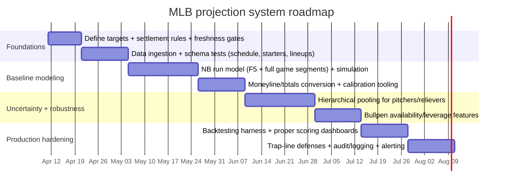

# Rigorous Methods for Projecting MLB Moneylines, Totals, and First Five Innings Markets

## Executive summary

Accurate projection of MLB moneylines and totals is best treated as a **probabilistic modeling problem over runs**, not a direct “predict the winner” classification. The clean mental model is: build (a) a predictive distribution for each team’s runs for the relevant segment (full game, F5, or in-play remainder), then (b) map those distributions into (i) moneyline win probability, (ii) total-run probabilities, and (iii) derivative markets (F5, runlines, alt totals). This aligns your model output with proper scoring rules and avoids hidden assumptions that often break calibration. citeturn4search1turn21view0

A pure independent-Poisson model is often too brittle because baseball run scoring is **overdispersed** relative to Poisson: empirical work comparing Poisson vs negative binomial on inning-level runs shows Poisson understates the probability of scoreless innings and understates variability; negative binomial improves the fit but still misses specific mass points. citeturn21view0 That pushes production systems toward **overdispersed count models** (negative binomial / Poisson-gamma mixtures), plus **hierarchical pooling** to stabilize estimates for sparse players (new starters, call-ups, new relievers). citeturn21view0turn8search6turn8search10

For dependence between team run outcomes (shared environment, umpire/park/weather), you can either (a) add a shared latent “run environment” factor (often the simplest), or (b) use explicit bivariate count models. The Dixon–Coles soccer framework is a useful conceptual reference for two things: (1) **low-score dependence corrections** and (2) **time-weighting** recency in estimation. Even though baseball isn’t low-scoring like soccer, the idea “don’t let an independence assumption silently break scoreline mass” still transfers. citeturn13view1turn14view0

For F5 markets, the most reliable approach is to model first five innings as its **own segment with different drivers**: starter quality dominates, bullpen uncertainty is reduced (but not eliminated), and you must explicitly model the chance the starter does **not** reach five innings. Times-through-the-order effects and the strategic “call to the bullpen” have measurable structure and should be reflected as a removal/hazard component or innings-allocation model. citeturn3search4turn9search7

Finally, on “book traps” and trap lines: the best defense is **discipline in validation and freshness**, not cleverness. There is strong evidence books are generally reliable forecasters and can exploit bettor biases; and empirical research on MLB line movement finds *mostly reliable forecasts* but also exploitable non-monotonicity and overreaction in some settings—meaning you need systematic safeguards (stale detection, de-vigging, audit logs, and strict separation between “projection-only” outputs and “actionable” bet decisions). citeturn6search3turn15view0

## Target definitions and market settlement semantics

### What the model should output

To support moneylines, totals, and F5 variants robustly, define outputs at two levels:

**Game-segment run distributions**
- Full game (includes extra innings for most sportsbook settlement):  
  - \(R_H^{FG}, R_A^{FG}\) = total runs scored by home/away team in the full wagering horizon. citeturn16search8turn18view2
- First five innings (F5):  
  - \(R_H^{F5}, R_A^{F5}\) = runs scored through the end of the 5th inning (or 4.5 if specified by a rule context; see below). citeturn18view2turn20view0

**Derived betting targets**
- Moneyline win probability (full game):  
  - \(p_{ML} = \Pr(R_H^{FG} > R_A^{FG})\)
- Total runs distribution (full game):  
  - \(T^{FG} = R_H^{FG} + R_A^{FG}\),  
  - \(p_{O/U}(L) = \Pr(T^{FG} > L)\) for an over line \(L\) (and similarly for under)
- Moneyline for F5:  
  - \(p_{F5} = \Pr(R_H^{F5} > R_A^{F5})\), plus explicit \(\Pr(\text{tie after 5})\) because many F5 moneyline markets void/refund on ties. citeturn16search28turn20view0
- F5 totals:  
  - \(T^{F5} = R_H^{F5} + R_A^{F5}\), \(p_{O/U}^{F5}(L) = \Pr(T^{F5} > L)\)

### Settlement rules you must align with (because “definitions are destiny”)

Sportsbooks vary, but two pieces are commonly true and materially change modeling:

- **Extra innings count** for many full-game moneyline and totals markets; moneyline is settled on the game outcome, which includes extra innings. citeturn16search8turn18view2  
- **F5 markets settle at 5 innings** (or 4.5 for some “game shortened” contexts), and F5 moneyline can be void if tied after five. citeturn16search28turn18view2turn20view0

Your modeling must therefore be explicit about:
- Whether your “full game” distributions include extra innings (and if so, which extra-inning rules apply).
- Whether your F5 moneyline is “tie/no bet” (void) or a 3-way market (home/away/tie).

### Extra-inning rules affect tails (and totals unders)

MLB regular season extra innings start each half-inning after the ninth with an automatic runner on second base (“designated runner”), which changes the run distribution in extras versus regulation. citeturn22search0turn22search4  
If your totals include extra innings (common), “under” bets have an additional tail risk that is not captured by a nine-inning-only model. citeturn16search8turn18view2

## Modeling approaches and when each one actually works

This section covers your requested families, but with a practical framing: **what each model is good at**, and how it maps to moneyline/totals/F5.

### Count models for runs

**Independent Poisson (baseline)**  
Model: \(R_H \sim \text{Poisson}(\lambda_H)\), \(R_A \sim \text{Poisson}(\lambda_A)\) with conditional independence given \(\lambda\). The run differential \(D=R_H-R_A\) follows a Skellam distribution in the independent Poisson case—useful for closed-form win and margin probabilities. citeturn1search0turn0search6  
Where it breaks: real run scoring shows overdispersion; Poisson understates variance and misallocates probability mass, especially for zero-run innings. citeturn21view0

**Negative binomial (recommended baseline for “runs as counts”)**  
Treat runs as NB to capture overdispersion (equivalently a Poisson-gamma mixture). Empirical comparison on MLB inning runs shows NB fits better than Poisson (though still imperfect at specific run counts). citeturn21view0turn10search3  
Practical note: You can estimate dispersion globally by season/park and partially pool by team/segment to avoid unstable dispersion estimates.

**Bivariate Poisson and related dependence models**  
If you want correlation between home/away scoring beyond shared covariates, bivariate Poisson constructions add a shared component. Dixon–Coles is a specific modification that perturbs probabilities for low-score cells while keeping Poisson marginals, and introduces a dependence parameter \(\rho\). citeturn13view1  
Baseball adaptation: rather than only “low scores,” you can use (a) a shared latent environment factor, or (b) copulas / shared random effects to couple \(R_H, R_A\).

**Dixon–Coles-style adjustments (transferable ideas)**  
Two key ideas from entity["people","Mark J. Dixon","appl statist 1997 author"] and entity["people","Stuart G. Coles","appl statist 1997 author"] that are directly useful in sports modeling:
- Correcting independence failures in scoreline probabilities via an explicit multiplicative adjustment \(\tau_{\lambda,\mu}(x,y)\) with dependence parameter \(\rho\). citeturn13view1
- Exponentially downweighting older matches with \(\phi(t)=\exp(-\xi t)\) and choosing \(\xi\) by predictive log-likelihood. citeturn14view0turn14view1  
Even if you don’t copy the soccer-specific cell adjustments, the “recency weighting + predictive selection” pattern is excellent for MLB where rosters, injuries, and form change rapidly.

**Conway–Maxwell–Poisson (CMP) and dispersion-flexible counts**  
When you want a single family that can handle over- and under-dispersion, CMP is a candidate; recent sports-focused work argues for CMP-type flexibility in count sports contexts including baseball. citeturn1search19  
Trade-off: inference is typically heavier than Poisson/NB; in production it’s often used only if NB residual structure is too persistent.

### Paired-comparison / rating models for win probability

These models target **win probability directly** (moneyline), and usually require a separate path for totals.

**Bradley–Terry**  
A paired-comparison model where \(P(i \text{ beats } j)\) is a logistic function of team strengths. The foundational method of paired comparisons is due to entity["people","Ralph Allan Bradley","paired comparisons 1952"] and entity["people","Milton E. Terry","paired comparisons 1952"]. citeturn5search4  
Pros: simple, interpretable, fast.  
Cons: without run modeling it can’t natively price totals, and it can leak hidden confounding (pitchers/lineups) into team strengths unless you augment it.

**Elo**  
Rating-system approach from entity["people","Arpad Elo","elo rating author 1978"]. citeturn5search1  
Pros: operationally simple; good as a backbone rating prior.  
Cons: not granular enough alone for pitcher/lineup; totals still need separate modeling.

**Logistic regression / GLMs**  
You can model moneyline as \(\Pr(\text{home win})=\sigma(\beta^\top x)\) with engineered features; for totals, use a separate count/continuous model (or joint model). This is often the best “first production” system because it is stable and debuggable, but it may cap ceiling unless you add non-linearities.

### Modern ML approaches

**Gradient-boosted trees (GBDT)**  
The core reference is entity["people","Jerome H. Friedman","gradient boosting 2001"]’s gradient boosting machine framework. citeturn5search2  
For scalable tree boosting implementations, the canonical reference is entity["people","Tianqi Chen","xgboost author"] and entity["people","Carlos Guestrin","xgboost author"] on XGBoost. citeturn5search7  
Pros: strong tabular performance; handles mixed feature types; good for interaction discovery.  
Cons: raw probabilities often need calibration; easy to overfit with leaky features.

**Neural networks**  
Pros: can learn complex interactions (especially with embeddings for players/teams); can be powerful if you have deep data and careful regularization.  
Cons: interpretability and stability; calibration can be poor without explicit constraints and post-hoc calibration. citeturn4search3

### Hierarchical Bayesian models and partial pooling (critical for sparse pitchers/relievers)

Baseball is a sparse-data sport at the player level in-season; hierarchical shrinkage is the antidote. A well-cited MLB hitting-performance example uses Bayesian hierarchical modeling with covariates (age/position) and mixture shrinkage. citeturn8search6  
The foundational motivation for shrinkage in baseball-style problems is extensively discussed in empirical Bayes and hierarchical Bayes literature. citeturn8search10turn8search22

### Ensemble methods (what “best in class” usually converges to)

In practice, robust MLB betting models are usually ensembles of:
- A **structural run model** (NB or similar) to get coherent totals and margins,
- A **discriminative win-prob model** (logistic/GBDT) for moneyline calibration and edge capture,
- A **market-anchored layer** that corrects systematic residuals while preventing leakage and stale/invalid reliance (details in the pitfalls section). citeturn4search1turn15view0

### Comparison table of approaches

| Model family | Best target fit | Pros | Cons / failure modes | Typical production role |
|---|---|---|---|---|
| Independent Poisson + Skellam | Totals + moneyline (closed form) | Fast; coherent run distribution; interpretable; Skellam gives analytic margin/win probabilities citeturn1search0turn0search6 | Understates variance vs MLB data; miscalibration if used raw citeturn21view0 | Baseline / sanity check; sometimes as a component in an ensemble |
| Negative binomial | Totals + moneyline | Captures overdispersion; easy to fit; robust in sparse settings with pooling citeturn21view0turn10search3 | Still misses certain mass points; dispersion estimation unstable w/o pooling citeturn21view0 | Recommended core run distribution |
| Bivariate Poisson / dependence models | Totals + moneyline + correlation | Models shared environment; can improve joint scoreline realism citeturn13view1 | Heavier inference; correlation structure easy to mis-specify | Add-on if independence residuals persist |
| Dixon–Coles variants | Joint scoreline modeling | Explicit dependence correction; rigorous time-weighting idea citeturn13view1turn14view0 | Soccer-specific low-score correction; baseball needs different structure | Inspiration for dependence + recency weighting |
| Bradley–Terry / Elo | Moneyline | Simple and stable; good priors; easy backtests citeturn5search4turn5search1 | Totals not native; can hide pitcher/lineup effects in “team strength” | Rating backbone and fallback |
| Logistic regression | Moneyline; totals via separate model | Interpretable; debuggable; strong baseline; easy calibration citeturn4search3 | Misses complex interactions; feature leakage risk | First production model; ensemble component |
| GBDT (e.g., boosting) | Moneyline + totals (separate heads) | High accuracy on tabular; captures interactions citeturn5search2turn5search7 | Needs calibration; overfits on leaky features; can chase noise citeturn4search3 | Main discriminative model in ensemble |
| Neural nets | Moneyline + totals | Flexible; can embed players; scalable | Harder to debug; calibration issues; data-hungry citeturn4search3 | Only after solid baselines |
| Hierarchical Bayesian | Player/pitcher components; uncertainty | Principled uncertainty; best for sparse players; partial pooling citeturn8search6turn8search10 | Computational cost; engineering complexity | Player priors + uncertainty engine |
| Markov / simulation game models | In-play + inning states | Captures base-out state; coherent in-play updates citeturn7search9turn7search0 | Requires granular event modeling; compute cost | In-play and extra-innings modeling |

## Feature engineering and data sources with freshness constraints

### Core feature blocks (what actually moves run expectancy)

A practical decomposition is: expected runs for a segment are driven by offense quality, pitcher quality (starter + bullpen), environment (park/weather/umpire), and context (rest/travel, lineup). Your feature set should be organized so each block can be updated independently as new information arrives (lineups, scratches, weather).

**Pitcher quality**
- Starter: strikeout, walk, HR suppression skill proxies; use ERA estimators like FIP/xFIP/SIERA as stable “skills” inputs (definitions and rationale documented in FanGraphs library). citeturn2search6turn2search18turn2search2  
- Statcast expected metrics (xwOBA, xERA) incorporate contact quality signals; xwOBA uses exit velocity and launch angle (and sprint speed in some contexts), and xERA maps expected wOBA to an ERA-scale metric. citeturn2search1turn2search5

**Lineups / hitters**
- Use projected lineup-level wOBA/wRC+ style aggregates (or Statcast expected stats aggregates) and platoon splits (L/R). Statcast field definitions for exporting data are documented via Baseball Savant CSV docs. citeturn2search9turn2search1

**Park factors**
- FanGraphs park factors encode how parks affect run scoring; their “100 = average” scaling and interpretation are defined in their park factor guide. citeturn3search3  
- Statcast park effects provide park impacts normalized to 100 and describe how effects are computed controlling for batter/pitcher and handedness. citeturn3search27

**Weather**
- Peer-reviewed evidence shows temperature materially changes MLB offense outcomes (runs, slugging, HR, etc.). citeturn8search0  
- MLB’s own reporting and baseball physics work note wind meaningfully affects batted-ball distance; this is consistent with physics-based analyses of temperature effects on HR production. citeturn8search1turn8search8

**Bullpen leverage and availability**
- Leverage Index (LI) is a context metric created by Tom Tango; FanGraphs summarizes LI as measuring the importance of a situation, with average LI = 1 and a long right tail. citeturn9search9  
- For modeling, bullpen “quality” is not just the roster but also (a) availability (recent usage), and (b) the chance high-leverage relievers are used in your segment (F5 vs innings 6–9). LI-driven usage patterns are discussed via gmLI interpretations. citeturn9search1turn9search0

**Travel / fatigue**
- Jet lag/time-zone travel has published evidence of impacting MLB performance. citeturn9search6turn9search2  
This is not a license to chase narrative; it’s a feature candidate that must be tested for incremental predictive value out-of-sample.

**Umpire / strike zone**
- There is empirical evidence that umpires exhibit systematic effects in strike-zone calls depending on context (e.g., count), and that strike-zone geometry and accuracy have evolved over time. citeturn3search30turn3search14  
Operationally: umpire features can help totals more than moneylines, but they are also higher-variance and more prone to “public narrative” traps unless validated.

### Data sources and freshness

Key sources you mentioned:

- Retrosheet provides detailed play-by-play event files and documentation of the scoring system, plus downloadable processed CSV “daily logs” covering large historical ranges (e.g., game-level data through recent seasons). citeturn2search3turn2search19turn2search23  
- MLB/Statcast: Statcast is described by MLB as a state-of-the-art tracking technology across pitch/hit/player tracking, and Baseball Savant provides documentation for Statcast-derived metrics and CSV exports. citeturn2search17turn2search9turn2search1  
- MLB Stats API / Gameday: the public endpoint host exists but official documentation is access-controlled; community endpoint references document endpoints such as win probability and live feeds. citeturn2search24turn7search10

### Data latency and reliability table

Latency thresholds are **unspecified** in your prompt, so the table distinguishes “intraday/live” vs “historical/batch” and recommends what must be “fresh” before producing **actionable** outputs.

| Data source | Primary uses | Freshness sensitivity | Reliability notes (modeling) |
|---|---|---|---|
| MLB Stats API / Gameday feeds | schedule, game state, play-by-play, live updates, win probability endpoints (community docs) citeturn7search10 | **High** for in-play and scratches/lineup changes (near game time) | Official docs gated; build robust retry + schema-change guards citeturn2search24turn7search10 |
| Baseball Savant / Statcast exports | pitch/batted-ball metrics; xwOBA/xBA/xSLG definitions; CSV schema docs citeturn2search1turn2search9 | **Medium–High** for current-season player form; lower for long-term skill priors | Great for quality-of-contact features; ensure you handle delayed updates and missing rows |
| FanGraphs library metrics | definitions of FIP/xFIP/SIERA, park factors methodology, etc. citeturn2search6turn3search3 | **Medium** (stats update daily/periodic) | Good, stable “skills” features; less live-sensitive than lineups |
| Retrosheet | historical play-by-play; event file documentation; daily logs downloads citeturn2search3turn2search19 | **Low** for real-time; excellent for training/backtests | Treat as ground-truth-ish for history; honor licensing/usage notices citeturn2search23 |
| Weather (NOAA/private vendors) | temperature/wind/pressure/humidity inputs | **High** on game day | Model impact is real (temperature effects published); ensure station mapping and dome flags citeturn8search0turn8search9 |

### Recommended feature set (prioritized)

| Priority | Feature group | Why it matters | For moneyline | For full-game totals | For F5 markets |
|---|---|---|---|---|---|
| Must-have | Projected starters + starter skill | Starting pitching is foundational; errors here destroy both sides and totals | ✅ | ✅ | ✅✅ (dominant) |
| Must-have | Lineup strength + platoon | Run scoring depends on who actually hits; platoons change expected run rates | ✅ | ✅ | ✅ |
| Must-have | Park factor + handedness | Park affects run environment; handedness splits matter for HR/run factors citeturn3search3turn3search27 | ✅ | ✅✅ | ✅ |
| Must-have | Weather (temp/wind) | Peer-reviewed: temperature increases runs/HR; wind affects batted-ball distance citeturn8search0turn8search1turn8search8 | ✅ | ✅✅ | ✅ |
| High | Bullpen quality + availability proxies | Matters most for innings 6–9 and extras; leverage usage is structured citeturn9search9turn9search1 | ✅ | ✅✅ | ⚠️ (less, but still if SP exits early) |
| Medium | Travel / jet lag | Published evidence suggests effects; must validate incremental lift citeturn9search6turn9search2 | ⚠️ | ⚠️ | ⚠️ |
| Medium | Umpire / strike-zone tendencies | Potential totals signal; risk of noise and narrative traps citeturn3search30turn3search14 | ⚠️ | ✅ | ⚠️ |
| Low | “Recent form” raw splits | Often mostly noise unless modeled with shrinkage and context | ⚠️ | ⚠️ | ⚠️ |

image_group{"layout":"carousel","aspect_ratio":"16:9","query":["MLB Statcast park factors leaderboard screenshot","FanGraphs park factors explanation graphic","Baseball Savant expected statistics xwOBA illustration"],"num_per_query":1}

## Calibration, conversion formulas, and mapping distributions to moneyline/totals

### Converting between probabilities and odds (and removing vig)

You need two conversions:

**American odds → implied probability**  
Common formulas (with sign conventions) are published in betting education references. citeturn10search8  
- If odds are +A: \(p_{imp} = \frac{100}{A+100}\)  
- If odds are −A: \(p_{imp} = \frac{A}{A+100}\)

**De-vigging / overround removal**  
Market implied probabilities across outcomes typically sum to > 1 due to the bookmaker margin (“vig/overround”). Your model should compare to **vig-free** probabilities (normalize or use a margin model) before you decide you have edge. citeturn10search1turn10search8

A simple two-outcome normalization:
- \(p_1^\* = \frac{p_{imp,1}}{p_{imp,1}+p_{imp,2}}\), \(p_2^\* = 1-p_1^\*\)

### Moneyline from run distributions

If you have the joint distribution \(P(R_H=r, R_A=s)\):
- \(p(\text{home win}) = \sum_{r>s} P(R_H=r, R_A=s)\)
- \(p(\text{tie after 9}) = \sum_{r=s} P(R_H=r, R_A=s)\)

If you assume independence given parameters:
- \(P(R_H=r, R_A=s) = P(R_H=r)\,P(R_A=s)\)

**Closed-form special case (independent Poisson):** the run differential \(D=R_H-R_A\) follows the Skellam distribution, originally derived by entity["people","J. G. Skellam","statistician skellam dist"]. citeturn1search0turn0search6  
Then:
- \(p(\text{home win}) = P(D>0)\)
- \(p(\text{tie}) = P(D=0)\)

**Why simulation is often better anyway:** once you introduce overdispersion (NB), dependence, bullpen uncertainty, and extra-inning rules (automatic runner on second), closed-form becomes messy and easy to get wrong. Simulation is usually safer and still fast at MLB scale.

### Totals from run distributions

If you have \(T = R_H + R_A\):
- \(p(\text{Over }L) = \sum_{t=L+1}^{\infty} P(T=t)\) for integer \(t\); for half-run lines (e.g., 7.5), it’s effectively \(P(T \ge 8)\).

Under independence:
- \(P(T=t)\) is the convolution of the two team run distributions.

### Calibrating probabilities and full predictive distributions

For moneyline probabilities (binary outcomes), evaluate and calibrate using proper scoring rules like Brier score (from entity["people","Glenn W. Brier","brier score author"]) citeturn4search0 and log loss / cross-entropy, and assess calibration and sharpness as formalized in the proper scoring rules literature by entity["people","Tilmann Gneiting","proper scoring rules author"] and entity["people","Adrian Raftery","proper scoring rules author"]. citeturn4search1turn4search16

For post-hoc calibration:
- Platt scaling from entity["people","John Platt","platt scaling author"] maps scores to probabilities via a logistic fit. citeturn4search2  
- Isotonic regression calibration is more flexible but can overfit in low data regimes; comparative evaluation is documented by Niculescu-Mizil & Caruana. citeturn4search3

For totals (full predictive distributions), consider CRPS or other distributional scoring rules (also formalized in proper scoring rules work). citeturn4search1

### Recommended formulas and pseudocode (production-oriented)

**Recommended base model (runs)**
1. Predict segment means \(\mu_H, \mu_A\) (full game or F5).
2. Convert to NB distributions with shared or pooled dispersion \(k\).
3. Monte Carlo simulate paired run outcomes and compute:
   - win probability
   - totals distribution
   - tie probability (for F5 tie-no-bet markets)

Pseudocode (skeleton):

```pseudo
function predict_game(game_context):
    features = build_features(game_context)   # starters, lineups, park, weather, bullpen, etc.

    # Segment means
    mu_H_F5, mu_A_F5 = model_mu_segment(features, segment="F5")
    mu_H_L4, mu_A_L4 = model_mu_segment(features, segment="L4")  # innings 6-9 (plus bullpen usage proxy)

    # Dispersion (pooled + adjusted)
    k_F5 = dispersion_model(features, segment="F5")   # could be global + park tweak
    k_L4 = dispersion_model(features, segment="L4")

    # Sample distributions
    samples = []
    for n in 1..N:
        rH_F5 ~ NegBin(mean=mu_H_F5, dispersion=k_F5)
        rA_F5 ~ NegBin(mean=mu_A_F5, dispersion=k_F5)
        rH_L4 ~ NegBin(mean=mu_H_L4, dispersion=k_L4)
        rA_L4 ~ NegBin(mean=mu_A_L4, dispersion=k_L4)

        rH_9 = rH_F5 + rH_L4
        rA_9 = rA_F5 + rA_L4

        # Extra innings (optional but recommended if your totals/ML include extras)
        rH_FG, rA_FG = resolve_extras_if_tied(rH_9, rA_9, features)

        samples.append({rH_F5, rA_F5, rH_FG, rA_FG})

    return summarize(samples)
```

**Extra innings resolver (must be rule-aware)**
- If moneyline/totals include extras, simulate extra innings using the automatic runner rule (runner on second) for regular season; MLB’s rule definition is explicit. citeturn22search0turn22search4  
A simple approximation is acceptable as a baseline (e.g., allocate tie win probability using a modeled “extras win prob”), but for pricing totals unders you should simulate the tail.

## F5 and in-play specifics

### Modeling first five innings as its own process

The biggest mistake is to treat F5 as “(5/9) of the full game.” It’s not, because:
- innings 1–5 are starter-heavy,
- bullpen involvement is conditional on early exits and high pitch counts,
- lineup-order effects and “times through the order” dynamics are more concentrated.

A strong approach is to explicitly model:
1. Probability distribution of **starter innings pitched** (or removal hazard by inning/pitch count).
2. Conditional run rates against starter vs early-relief.
3. A joint segment model for F5 that mixes starter and bullpen contributions based on (1).

Work on time-through-the-order estimation shows why naive cutoff assumptions can mislead, and provides Bayesian regression structure for disentangling confounding from true discontinuities. citeturn3search4turn3search0  
Research on the “call to the bullpen” decision frames starter removal as a strategic and empirically analyzable decision, which is relevant to modeling early exits (critical for F5 totals). citeturn9search7

### In-play models: Markov state, run expectancy, and live updating

For in-play, instead of predicting total runs directly, you often model:
- base-out state (24 states) and inning/score context,
- estimated run potential for remainder of inning/game,
- win probability as a function of state.

Markov chain approaches to baseball provide a principled way to compute run and win distributions from player-level event probabilities; a classic reference introduces a Markov chain method not restricted to a narrow runner-advancement model. citeturn7search9turn7search1  
Run expectancy matrices and base-out linear weights are also widely documented and operationally useful for fast in-play approximations. citeturn7search0turn7search8

If you consume win probability from MLB endpoints (for validation or baseline), community endpoint references document a winProbability API path. citeturn7search10

### Bullpen uncertainty and leverage

Bullpen modeling is where most “trap totals” live. Two practical insights:
- Reliever quality ≠ reliever usage. You must model whether top arms appear, which is leverage- and rest-dependent.
- Leverage Index gives a structured handle on bullpen usage intensity; FanGraphs’ LI primer describes LI as measuring importance of situations, and gmLI as average leverage on entry. citeturn9search9turn9search1

### Rule-change awareness (context for training windows)

Modern MLB run environments and strategies have shifted with rule changes like extra-inning automatic runner and pitch timer adjustments; MLB’s glossary pages define these rules and note scope (regular season). citeturn22search0turn22search1turn22search4  
Practical implication: your backtests should be segmented by rule era (pre-2020 extras vs post-2020/2023 automatic runner; post-2023 pitch timer era).

image_group{"layout":"carousel","aspect_ratio":"16:9","query":["MLB automatic runner on second base extra innings diagram","baseball run expectancy matrix 24 states visualization","MLB pitch clock timer in stadium photo"],"num_per_query":1}

## Evaluation, backtesting, production implementation, and trap-line defenses

### Evaluation metrics that matter

For moneyline probability forecasts:
- **Brier score** (mean squared error on probabilities) was introduced in a probability forecast verification context and remains a standard proper scoring rule. citeturn4search0  
- **Log loss** is also strictly proper and punishes overconfident wrong predictions (useful to prevent “hot take” models). citeturn4search1  
- **Calibration plots** and PIT/reliability diagnostics are emphasized in probabilistic forecasting literature. citeturn4search16turn4search1  

For totals / full predictive distributions:
- Use distributional scoring rules (e.g., CRPS) and not just point MAE/RMSE (which can reward “blurry” forecasts). citeturn4search1

For betting simulation:
- Track EV, CLV (if you have closing lines), and bankroll growth under sizing rules.
- Be explicit: profitability simulations are high-variance and can be misleading; use them after you have strong proper-scoring validation.

### Kelly sizing (and why it’s not a toy)

The Kelly criterion originates in the information-theoretic gambling formulation by entity["people","John L. Kelly Jr.","kelly criterion author"]. citeturn6search0turn6search4  
In production betting, fractional Kelly is common because model error and non-stationarity make full Kelly fragile.

### Practical implementation notes (regularization, pooling, ensembling)

**Regularization**
- Use shrinkage/regularization for high-dimensional feature sets; Lasso from entity["people","Robert Tibshirani","lasso author"] is a canonical reference. citeturn8search3turn8search7

**Hierarchical pooling**
- For low-sample pitchers/relievers, use hierarchical priors so recent MLB innings don’t dominate. Baseball-specific hierarchical Bayes work demonstrates mixture shrinkage and covariate use for player performance. citeturn8search6turn8search10

**Ensembling**
- Combine (i) structural run model + (ii) discriminative win-prob model + (iii) calibration layer.
- Keep an interpretable “audit trail”: feature snapshots, model versions, and source freshness status at prediction time.

### Trap-line defenses and market-aware safeguards

This is the “don’t get mugged by the book” section. The goal is not to “outsmart Vegas by vibes”; it’s to prevent systematic own-goals.

**Do not treat public betting splits as signal unless you can prove it.**  
Books can exploit bettor biases via price setting; a classic economics reference argues bookmakers are more skilled predictors and can set non-market-clearing prices to increase profits. citeturn6search3

**Assume markets are *mostly* efficient—and then look for specific, testable deviations.**  
An MLB-focused market study examining real-time line movement across sportsbooks finds forecasts are mostly reliable but identifies exploitable patterns like non-monotonic forecast quality near start times and negatively autocorrelated changes consistent with overreaction. citeturn15view0  
Implication: “contrarian” strategies need to be mechanized and validated, not improvised.

**Freshness gates and anchor validation (operational, not philosophical)**  
To avoid “trap lines” caused by bad inputs:
- Require explicit data freshness checks (lineups, starters, weather, odds) before you label any output “actionable.”  
- Separate “projection-only” outputs (OK with stale seeds, clearly labeled) from “bet recommendations” (must meet freshness + validation gates). This mirrors the idea that pipeline health and model execution need distinct signals rather than one gate masking everything. citeturn15view0turn4search1

**Extra innings and totals traps**  
Because extra innings count for settlement in many books, unders can be systematically underpriced if your model ignores extra-innings tail risk—especially under the automatic runner rule. citeturn16search8turn22search0turn22search4

### Mermaid pipeline diagrams

Model pipeline (training + inference):

```mermaid
flowchart TD
  A[Raw sources: schedule, starters, lineups, park, weather, Statcast, historical logs] --> B[Ingestion + schema validation]
  B --> C[Feature store with timestamps]
  C --> D[Segment mean models: F5 and late innings]
  D --> E[Run distribution layer: NB + pooled dispersion]
  E --> F[Simulation engine: samples of runs, ties, extras]
  F --> G[Derived markets: ML, totals, F5 ML/totals]
  G --> H[Calibration layer: Platt / isotonic / beta calibration]
  H --> I[Decision gate: freshness + validity + audit log]
  I --> J[Outputs: projections + (optional) actionable bets]
```

Timeline (prioritized roadmap, no tech stack assumed):



### Suggested unit tests, integration tests, and acceptance criteria

**Unit tests (deterministic math)**
- Odds conversion: American odds ↔ implied probability and de-vig normalization mirror known formulas. citeturn10search8turn10search1  
- Distribution math: convolution for totals; win probability from sampled (or enumerated) joint distributions.  
- Extra innings module: when “automatic runner” is enabled, simulated extras show higher run probability than a bases-empty extra inning baseline (sanity check tied to the rule definition). citeturn22search0turn22search4

**Integration tests (data + pipeline)**
- Feed robustness: schema-change tolerance for Statcast CSV exports (field presence/nullable handling) based on documented field lists. citeturn2search9  
- Freshness: if lineup is missing or starter changed after snapshot time, the system must mark “actionable = false” and still allow “projection-only = true” outputs (with explicit stale labels).  
- Settlement-aligned outputs: F5 moneyline ties return “void/push” logic aligned with house rules descriptions (tie-no-bet) and do not force a winner. citeturn16search28turn20view0

**Acceptance criteria (production deployment)**
- Calibration: out-of-sample moneyline calibration error is within a predefined tolerance (tolerance unspecified in your prompt), and is monitored continuously via Brier/log loss and calibration curves. citeturn4search0turn4search16  
- Totals: predictive distribution scoring (e.g., CRPS) improves vs Poisson baseline and does not degrade materially across parks/weather regimes. citeturn21view0turn4search1  
- Operational: every produced prediction is traceable to (a) feature timestamp set, (b) model version, (c) freshness status, and (d) decision-gate outcome.  
- Safety against “trap lines”: actionable recommendations are blocked when anchor/market inputs are stale or missing, and the system logs the reason (no silent failures). citeturn15view0turn6search3